---
## Front matter
lang: ru-RU
title: Лабораторная работа №1
subtitle: Презентация
author:
  - Мосолов А.Д.
institute:
  - Российский университет дружбы народов, Москва, Россия
date: 02 марта 2024

## i18n babel
babel-lang: russian
babel-otherlangs: english

## Formatting pdf
toc: false
toc-title: Содержание
slide_level: 2
aspectratio: 169
section-titles: true
theme: metropolis
header-includes:
 - \metroset{progressbar=frametitle,sectionpage=progressbar,numbering=fraction}
 - '\makeatletter'
 - '\beamer@ignorenonframefalse'
 - '\makeatother'

## Fonts
mainfont: PT Serif
romanfont: PT Serif
sansfont: PT Sans
monofont: PT Mono
mainfontoptions: Ligatures=TeX
romanfontoptions: Ligatures=TeX
sansfontoptions: Ligatures=TeX,Scale=MatchLowercase
monofontoptions: Scale=MatchLowercase,Scale=0.9
---

## Докладчик

:::::::::::::: {.columns align=center}
::: {.column width="70%"}

  * Мосолов Александр Денисович
  * Студент, НПИбд02-23
  * Российский университет дружбы народов
  * [1132236128@pfur.ru](mailto:1132236128@pfur.ru)

:::
::: {.column width="30%"}

:::
::::::::::::::

## Цель

Целью данной работы является приобретение практических навыков установки операционной системы на виртуальную машину, настройки минимально необходимых для дальнейшей работы сервисов.

## Задание

Научиться устанавливать Fedora Sway, настроить ее для дальнейшей работы.

## Запуск виртуальной машины с диска

Скачиваем с официального сайта Fedora Sway, прикрепляем файл с расширением .iso в поле

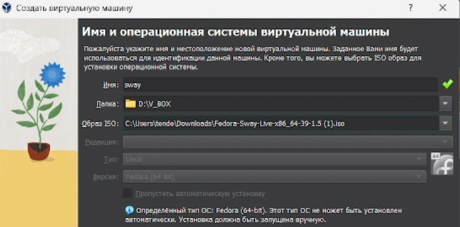{height=60%}

## Выбор языка

Выбираем язык

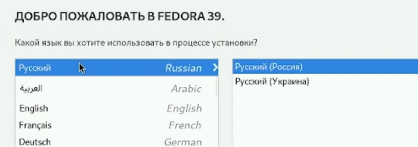

## Пользователь almos05

Настраиваем пользователя almos05

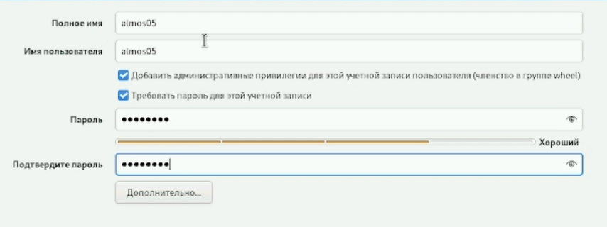

Настраиваем root пользователя

## root пользователь

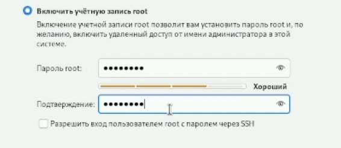

## Режим root

Переходим в режим суперпользователя

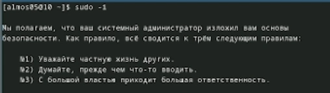

## Обновление пакетов

Обновляем все пакеты

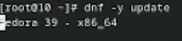

## Открываем файл /etc/selinux/config

Открываем файл /etc/selinux/config с помощью nano

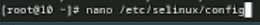{height=60%}

## Замена значения

В файле /etc/selinux/config замените значение  
SELINUX=enforcing  
на значение  
SELINUX=permissive

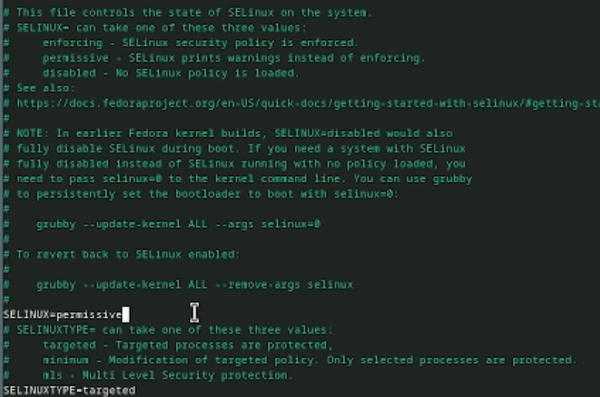{height=30%}

## Запускаем терминальный мультиплексор

Перезапускаем виртуальную машину с помощью команды reboot и запускаем терминальный мультиплексор tmux

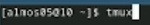

## Установка средств разработки

Установливаем средства разработки

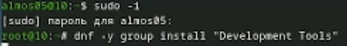

## Установка пакет DKMS

Установливаем пакет DKMS

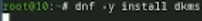

## Подключение образа диска дополнений гостевой ОС

В меню виртуальной машины подключаем образ диска дополнений гостевой ОС.

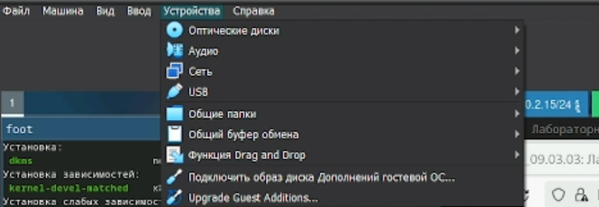{height=60%}

## Подмонтируйте диск

Подмонтируйте диск

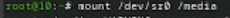

## Устанавливаем драйвера для VirtualBox

Устанавливаем драйвера

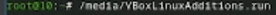

## Открываем конфигурационный файл

Создаём конфигурационный файл ~/.config/sway/config.d/95-system-keyboard-config.conf и открываем его

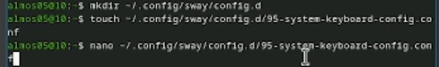

## Редактируем конфигурационный файл

Редактируем конфигурационный файл ~/.config/sway/config.d/95-system-keyboard-config.conf

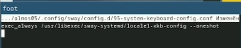

## Открываем файл /etc/X11...

Открываем файл /etc/X11/xorg.conf.d/00-keyboard.conf

## Редактируем конфигурационный файл /etc/X11

Редактируем конфигурационный файл /etc/X11/xorg.conf.d/00-keyboard.conf

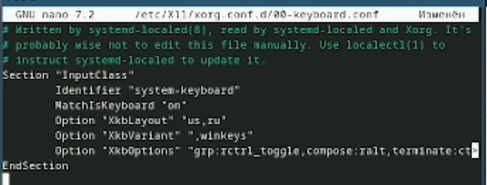

## Устанавливаем имя хоста

Устанавливаем имя хоста

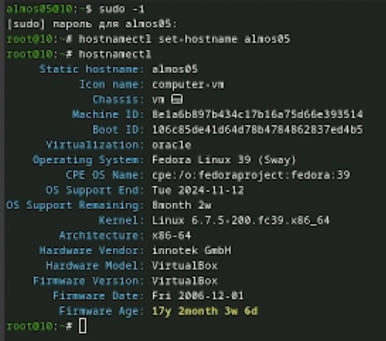{height=60%}

## Создаем папку work

Создаем в хостовой системе на диске C:\ папку work

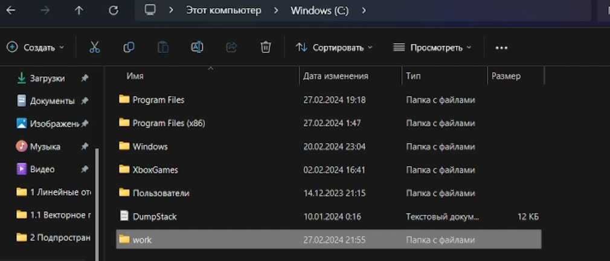{height=60%}

## Подключаем разделяемую папку

С помощью команды

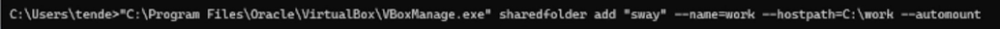

Перезагружаем виртуальную машину.

## Запуск tmux

Установливаем программное обеспечение для создания документации. Запускаем терминальный мультиплексор tmux  

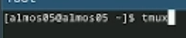

## Установка pandoc

Переключаемся на роль супер-пользователя, устанавливаем  с помощью менеджера пакетов - средство pandoc для работы с языком разметки Markdown

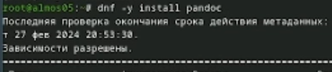

## Выбор версии

Версия 3.16.0a нам подходит (пакет уст. pandoc-crossref) 

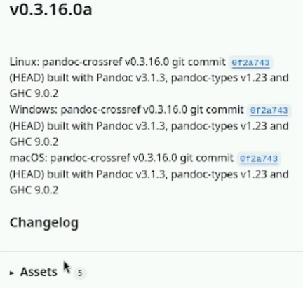{height=60%}

## Проверяем загрузки

Проверяем загрузки

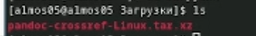

## Распаковываем и перемещаем

Распаковываем архив и перемещаем файл в /usr/local/bin

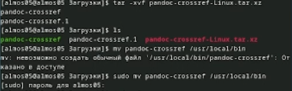

Установим дистрибутив TeXlive

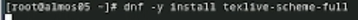

## Домашнее задание

В окне терминала проанализируйте последовательность загрузки системы, выполнив команду dmesg

Можно использовать поиск с помощью grep:  

dmesg | grep -i "то, что ищем"  

Получите следующую информацию.  
Версия ядра Linux (Linux version).  
Частота процессора (Detected Mhz processor).  
Модель процессора (CPU0).  
Объём доступной оперативной памяти (Memory available).  
Тип обнаруженного гипервизора (Hypervisor detected).  
Тип файловой системы корневого раздела.  

## Linux version

Версия ядра Linux

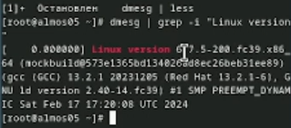

## Detected Mhz processor

Частота процессора

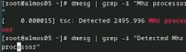

## CPU0

Модель процессора

Объём доступной оперативной памяти

## Memory available

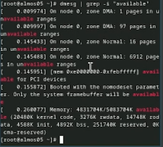

Тип обнаруженного гипервизора

## Hypervisor detected

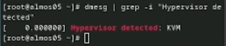

## Тип файловой системы корневого раздела

Тип файловой системы корневого раздела

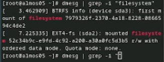

## Контрольные вопросы

Учётная запись пользователя включает в себя следующую информацию:

Для получения справки по команде:
Вы можете использовать команду man, например: man useradd.

Для перемещения по файловой системе используется команда cd

Для просмотра содержимого каталога используется команда ls. Например: ls -l. 

Для определения объёма каталога можно использовать команду du. Например: du -sh /path/to/directory.

Для создания каталога используется команда mkdir. 
Для удаления каталога используется команда rm -r. 
Для создания файла используется команда touch. Например: touch new_file.txt.
Для удаления файла используется команда rm. Например: rm old_file.txt.

Для просмотра истории команд используется команда history. Например: history | less.

Файловая система - это способ организации данных на носителе.

Для просмотра подмонтированных файловых систем в ОС, вы можете использовать команду df -Th.

Для удаления зависшего процесса в Linux можно использовать команду kill.

## Выводы

В ходе работы мы приобрели практические навыки установки операционной системы на виртуальную машину, настройки минимально необходимых для дальнейшей работы сервисов. 
