---
## Front matter
title: "Лабораторная работа №1"
subtitle: "Отчёт"
author: "Александр Денисович Мосолов"

## Generic otionsв
lang: ru-RU
toc-title: "Содержание"

## Bibliography
bibliography: bib/cite.bib
csl: pandoc/csl/gost-r-7-0-5-2008-numeric.csl

## Pdf output format
toc: true # Table of contents
toc-depth: 2
lof: true # List of figures
lot: true # List of tables
fontsize: 12pt
linestretch: 1.5
papersize: a4
documentclass: scrreprt
## I18n polyglossia
polyglossia-lang:
  name: russian
  options:
	- spelling=modern
	- babelshorthands=true
polyglossia-otherlangs:
  name: english
## I18n babel
babel-lang: russian
babel-otherlangs: english
## Fonts
mainfont: PT Serif
romanfont: PT Serif
sansfont: PT Sans
monofont: PT Mono
mainfontoptions: Ligatures=TeX
romanfontoptions: Ligatures=TeX
sansfontoptions: Ligatures=TeX,Scale=MatchLowercase
monofontoptions: Scale=MatchLowercase,Scale=0.9
## Biblatex
biblatex: true
biblio-style: "gost-numeric"
biblatexoptions:
  - parentracker=true
  - backend=biber
  - hyperref=auto
  - language=auto
  - autolang=other*
  - citestyle=gost-numeric
## Pandoc-crossref LaTeX customization
figureTitle: "Рис."
tableTitle: "Таблица"
listingTitle: "Листинг"
lofTitle: "Список иллюстраций"
lotTitle: "Список таблиц"
lolTitle: "Листинги"
## Misc options
indent: true
header-includes:
  - \usepackage{indentfirst}
  - \usepackage{float} # keep figures where there are in the text
  - \floatplacement{figure}{H} # keep figures where there are in the text
---

# Цель работы

Целью данной работы является приобретение практических навыков установки операционной системы на виртуальную машину, настройки минимально необходимых для дальнейшей работы сервисов. [@TUIS]

# Задание

Научиться устанавливать Fedora Sway, настроить ее для дальнейшей работы.

# Выполнение лабораторной работы

Скачиваем с официального сайта Fedora Sway, прикрепляем файл с расширением .iso в поле (рис. [-@fig:001])

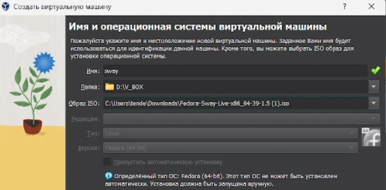{#fig:001 width=70%}

Задаём настройки оборудования виртуальной машины (рис. [-@fig:002])

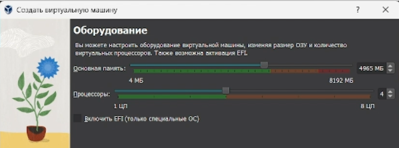{#fig:002 width=70%}

Задаём размер жесткого диска - 80 Гб (рис. [-@fig:003]):

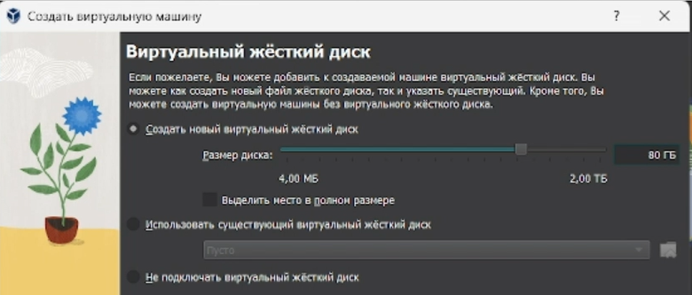{#fig:003 width=70%}

Выбираем язык (рис. [-@fig:004])

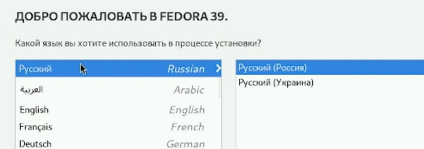{#fig:004 width=70%}

Настраиваем пользователя almos05 (рис. [-@fig:005]):

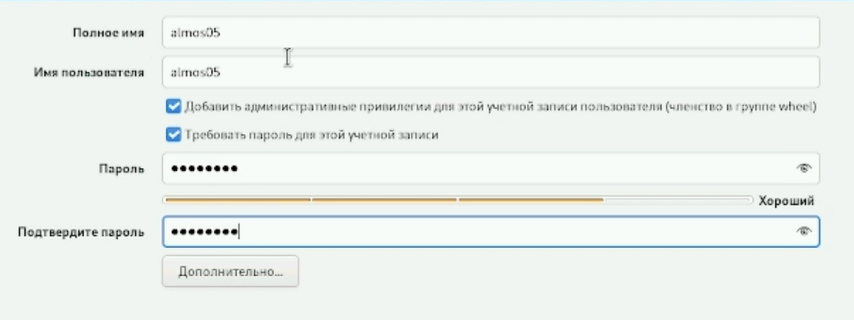{#fig:005 width=70%}

Настраиваем root пользователя (рис. [-@fig:006]):

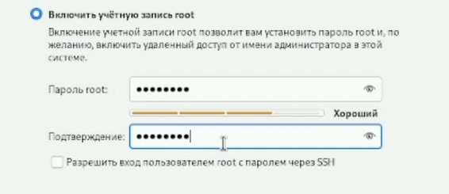{#fig:006 width=70%}

Используя Win + D находим Foot и открываем терминал (рис. [-@fig:007]):

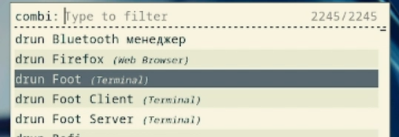{#fig:007 width=70%}

Переходим в режим суперпользователя (рис. [-@fig:008]):

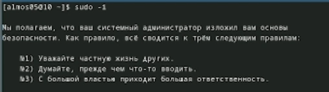{#fig:008 width=70%}

Обновляем все пакеты (рис. [-@fig:009]):

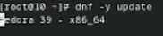{#fig:009 width=70%}

Программы для удобства работы в консоли:  
*dnf -y install tmux mc*

При необходимости можно использовать автоматическое обновление.

Установка программного обеспечения (рис. [-@fig:010]):

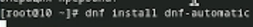{#fig:010 width=70%}

Запускаем таймер (рис. [-@fig:011]):

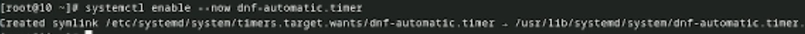{#fig:011 width=70%}

Открываем файл /etc/selinux/config с помощью nano (рис. [-@fig:012]):

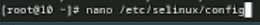{#fig:012 width=70%}

В файле /etc/selinux/config замените значение  
SELINUX=enforcing  
на значение  
SELINUX=permissive (рис. [-@fig:013]):

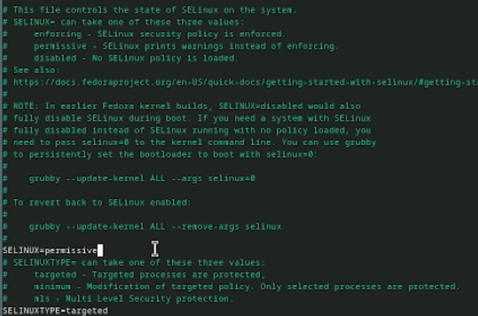{#fig:013 width=70%}

Перезапускаем виртуальную машину с помощью команды reboot (рис. [-@fig:014]):

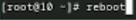{#fig:014 width=70%}

Запускаем терминальный мультиплексор tmux (рис. [-@fig:015]):

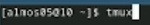{#fig:015 width=70%}

Установливаем средства разработки (рис. [-@fig:016]):

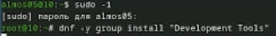{#fig:016 width=70%}

Установливаем пакет DKMS (рис. [-@fig:017]):

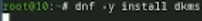{#fig:017 width=70%}

В меню виртуальной машины подключаем образ диска дополнений гостевой ОС. (рис. [-@fig:018]):

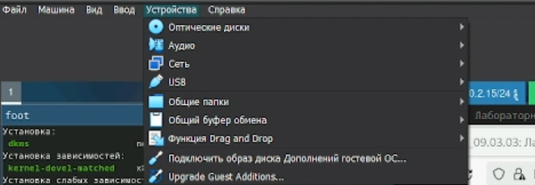{#fig:018 width=70%}

Подмонтируйте диск (рис. [-@fig:019]):

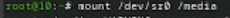{#fig:019 width=70%}

Устанавливаем драйвера (рис. [-@fig:020]):

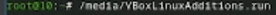{#fig:020 width=70%}

Перегрузите виртуальную машину:  
*reboot*

Запускаем терминальный мультиплексор tmux:  
*tmux*

Создаём конфигурационный файл ~/.config/sway/config.d/95-system-keyboard-config.conf и открываем его (рис. [-@fig:021]):

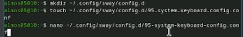{#fig:021 width=70%}

Редактируем конфигурационный файл ~/.config/sway/config.d/95-system-keyboard-config.conf (рис. [-@fig:022]):

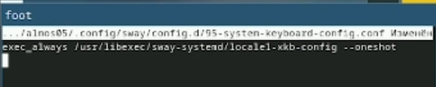{#fig:022 width=70%}

Открываем файл /etc/X11/xorg.conf.d/00-keyboard.conf (рис. [-@fig:023]):

{#fig:023 width=70%}

Редактируем конфигурационный файл /etc/X11/xorg.conf.d/00-keyboard.conf (рис. [-@fig:024]):

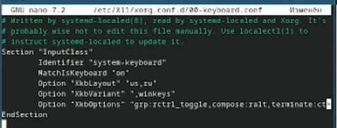{#fig:024 width=70%}

Устанавливаем имя хоста (рис. [-@fig:025]):

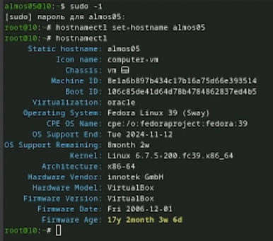{#fig:025 width=70%}

Создаем в хостовой системе на диске C:\ папку work (рис. [-@fig:026]):

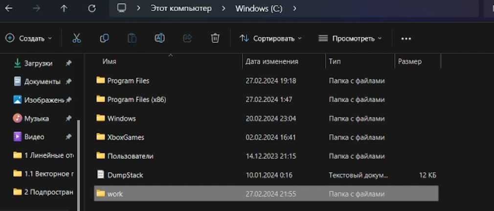{#fig:026 width=70%}

Подключаем разделяемую папку (рис. [-@fig:027]):

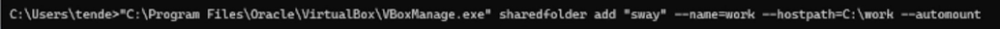{#fig:027 width=70%}

Перезагружаем виртуальную машину.

Установливаем программное обеспечение для создания документации. Запускаем терминальный мультиплексор tmux  (рис. [-@fig:028]):

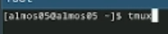{#fig:028 width=70%}

Переключаемся на роль супер-пользователя, устанавливаем  с помощью менеджера пакетов - средство pandoc для работы с языком разметки Markdown (рис. [-@fig:029]):

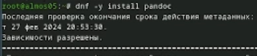{#fig:029 width=70%}

Версия 3.16.0a нам подходит (пакет уст. pandoc-crossref) (рис. [-@fig:030]):

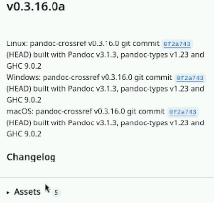{#fig:030 width=70%}

Проверяем загрузки (рис. [-@fig:031]):

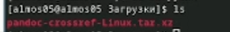{#fig:031 width=70%}

Распаковываем архив и перемещаем файл в /usr/local/bin (рис. [-@fig:032]):

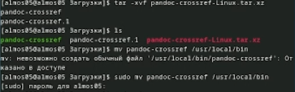{#fig:032 width=70%}

Установим дистрибутив TeXlive (рис. [-@fig:033]):

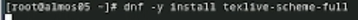{#fig:033 width=70%}

# Домашнее задание

Версия ядра Linux (рис. [-@fig:034]):

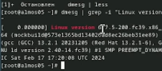{#fig:034 width=70%}

Частота процессора (рис. [-@fig:035]):

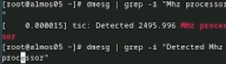{#fig:035 width=70%}

Модель процессора (рис. [-@fig:036]):

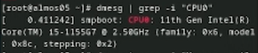{#fig:036 width=70%}

Объём доступной оперативной памяти (рис. [-@fig:037]):

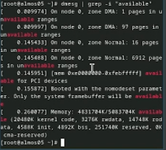{#fig:037 width=70%}

Тип обнаруженного гипервизора (рис. [-@fig:037]):

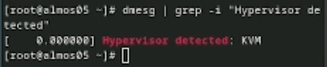{#fig:038 width=70%}

Тип файловой системы корневого раздела (рис. [-@fig:039]):

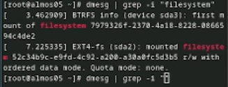{#fig:039 width=70%}

# Контрольные вопросы

Учётная запись пользователя включает в себя следующую информацию:

Для получения справки по команде:
Вы можете использовать команду man, например: man useradd.

Для перемещения по файловой системе:
Для перемещения по файловой системе используется команда cd. Например, для перехода в домашний каталог пользователя: cd ~.

Для просмотра содержимого каталога:
Для просмотра содержимого каталога используется команда ls. Например: ls -l.

Для определения объёма каталога:
Для определения объёма каталога можно использовать команду du. Например: du -sh /path/to/directory.

Для создания / удаления каталогов / файлов:

Для создания каталога используется команда mkdir. Например: mkdir new_directory.
Для удаления каталога используется команда rm -r. Например: rm -r old_directory.
Для создания файла используется команда touch. Например: touch new_file.txt.
Для удаления файла используется команда rm. Например: rm old_file.txt.
Для задания определённых прав на файл / каталог:
Для задания прав на файл или каталог используется команда chmod. Например: chmod 755 file.txt.

Для просмотра истории команд:
Для просмотра истории команд используется команда history. Например: history | less. 

Файловая система - это способ организации данных на носителе. Примеры файловых систем включают ext4, NTFS, FAT32 и другие. Они имеют разные характеристики и поддерживают различные функции. 

Для просмотра подмонтированных файловых систем в ОС, вы можете использовать команду df -Th.

Для удаления зависшего процесса в Linux можно использовать команду kill. Найдите PID (идентификатор процесса) зависшего процесса с помощью команды ps aux | grep <название_процесса> и используйте команду kill -9 <PID>, чтобы принудительно завершить процесс.

# Выводы

В ходе работы мы приобрели практические навыки установки операционной системы на виртуальную машину, настройки минимально необходимых для дальнейшей работы сервисов. 

# Список литературы{.unnumbered}

::: {#refs}
:::
