---
## Front matter
lang: ru-RU
title: Лабораторная работа №2
subtitle: Презентация
author:
  - Мосолов А.Д.
institute:
  - Российский университет дружбы народов, Москва, Россия
date: 02 марта 2024

## i18n babel
babel-lang: russian
babel-otherlangs: english

## Formatting pdf
toc: false
toc-title: Содержание
slide_level: 2
aspectratio: 169
section-titles: true
theme: metropolis
header-includes:
 - \metroset{progressbar=frametitle,sectionpage=progressbar,numbering=fraction}
 - '\makeatletter'
 - '\beamer@ignorenonframefalse'
 - '\makeatother'

## Fonts
mainfont: PT Serif
romanfont: PT Serif
sansfont: PT Sans
monofont: PT Mono
mainfontoptions: Ligatures=TeX
romanfontoptions: Ligatures=TeX
sansfontoptions: Ligatures=TeX,Scale=MatchLowercase
monofontoptions: Scale=MatchLowercase,Scale=0.9
---

## Докладчик

:::::::::::::: {.columns align=center}
::: {.column width="70%"}

  * Мосолов Александр Денисович
  * Студент, НПИбд02-23
  * Российский университет дружбы народов
  * [1132236128@pfur.ru](mailto:1132236128@pfur.ru)

:::
::: {.column width="30%"}

:::
::::::::::::::

## Цель

Изучить идеологию и применение средств контроля версий.  
Освоить умения по работе с git.

## Задание

Научиться применять команды git, работать с github.

## Установка git и gh

Установим git и gh

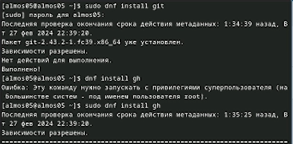

## Задаём имя и email

Зададим имя и email владельца репозитория

*git config --global user.name "Aleksandr Mosolov"*  
*git config --global user.email "tenderboylive2@gmail.com"*:

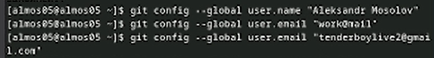

## Настраиваем кодировку, задаём имя ветки и указываем параметры

Настроим utf-8 в выводе сообщений git  
Зададим имя начальной ветки (будем называть её master)  
Параметр autocrlf  
Параметр safecrlf

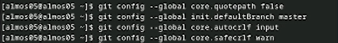

## Создаём ключ по алгоритму rsa

По алгоритму rsa с ключём размером 4096 бит  
*ssh-keygen -t rsa -b 4096*

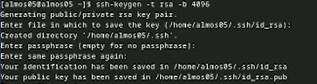

По алгоритму ed25519  
*ssh-keygen -t ed25519*

## Создаём ключ по алгоритму ed25519

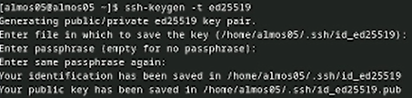

Генерируем ключ  
*gpg --full-generate-key*  

## Генерируем ключ

Из предложенных опций выбираем:  
тип RSA and RSA;
размер 4096;
выберите срок действия; значение по умолчанию — 0 (срок действия не истекает никогда).

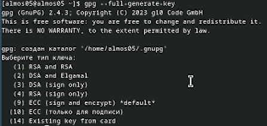

## Выводим и копируем ключ

Выводим список ключей и копируем отпечаток приватного ключа:  
*gpg --list-secret-keys --keyid-format LONG*

Выводим и копируем ключ  
*gpg --armor --export tenderboylive2@gmail.com | cat*

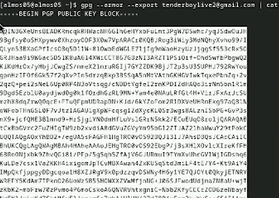{height=40%}

## GPG key

Переходим в настройки GitHub (https://github.com/settings/keys), нажмаем на кнопку New GPG key и вставляем полученный ключ в поле ввода.

## Настраиваем конфиг

Настраиваем конфиг  
*git config --global user.signingkey tenderboylive2@gmail.com*  
*git config --global commit.gpgsign true*  
*git config --global gpg.program $(which gpg2)*  

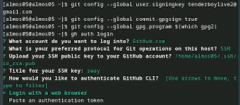{height=40%}

## Создаём шаблон

Необходимо создать шаблон рабочего пространства  
*mkdir -p ~/work/study/2023-2024/"Операционные системы"*  
*cd ~/work/study/2023-2024/"Операционные системы"*  
*gh repo create study_2023-2024_os-intro --template=yamadharma/course-directory-student-template --public*  
*git clone --recursive git@github.com:<owner>/study_2023-2024_os-intro.git os-intro*

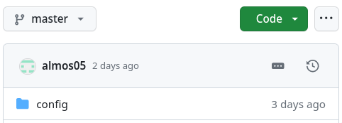{height=40%}

## Удаляем лишние файлы

Переходим в каталог курса и удаляем лишние файлы:  
*cd ~/work/study/2023-2024/"Операционные системы"/os-intro*  
*rm package.json*

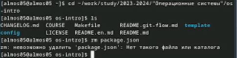

## Создание необходимых каталогов

Создаём необходимые каталоги  
*echo os-intro > COURSE*  
*make*

## Фиксируем изменения

Фиксируем изменения на github  
*git add .*  
*git commit -am 'feat(main): make course structure'*  
*git push*

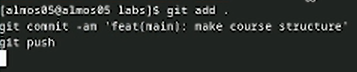

## Выводы

В ходе работы мы изучили идеологию и применение средств контроля версий.
Освоили умения по работе с git. 
