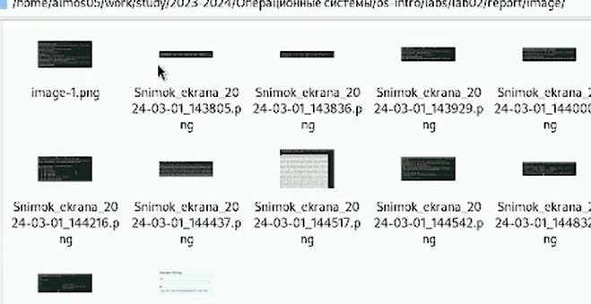
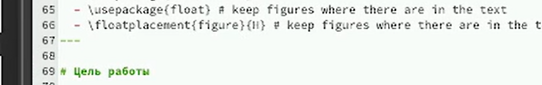
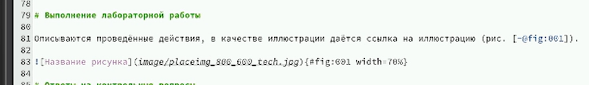
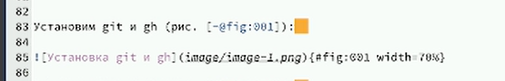
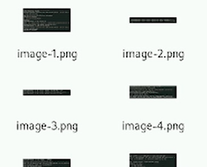
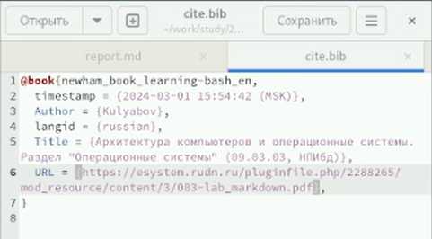
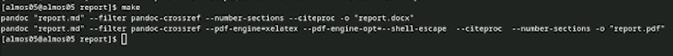
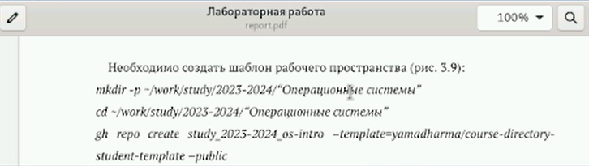

---
## Front matter
lang: ru-RU
title: Лабораторная работа №2
subtitle: Презентация
author:
  - Мосолов А.Д.
institute:
  - Российский университет дружбы народов, Москва, Россия
date: 02 марта 2024

## i18n babel
babel-lang: russian
babel-otherlangs: english

## Formatting pdf
toc: false
toc-title: Содержание
slide_level: 2
aspectratio: 169
section-titles: true
theme: metropolis
header-includes:
 - \metroset{progressbar=frametitle,sectionpage=progressbar,numbering=fraction}
 - '\makeatletter'
 - '\beamer@ignorenonframefalse'
 - '\makeatother'

## Fonts
mainfont: PT Serif
romanfont: PT Serif
sansfont: PT Sans
monofont: PT Mono
mainfontoptions: Ligatures=TeX
romanfontoptions: Ligatures=TeX
sansfontoptions: Ligatures=TeX,Scale=MatchLowercase
monofontoptions: Scale=MatchLowercase,Scale=0.9
---

## Докладчик

:::::::::::::: {.columns align=center}
::: {.column width="70%"}

  * Мосолов Александр Денисович
  * Студент, НПИбд02-23
  * Российский университет дружбы народов
  * [1132236128@pfur.ru](mailto:1132236128@pfur.ru)

:::
::: {.column width="30%"}

:::
::::::::::::::

## Цель

Научиться оформлять отчёты с помощью легковесного языка разметки Markdown.

## Задание

Сделайте отчёт по предыдущей лабораторной работе в формате Markdown.
– В качестве отчёта просьба предоставить отчёты в 3 форматах: pdf, docx и md (в архиве,
поскольку он должен содержать скриншоты, Makefile и т.д.)

## Выбор скриншотов

Вырезаем из скринкаста нужные скриншоты

## Размещаем заголовки

Заполняем основные разделы, размещаем заголовки с помощью #

## Делаем ссылки

Предоставляем оформленную информацию со ссылкой на рисунки

## Синтаксис размещения фотографий

Описываем действия из туиса, размещаем фотографии к тексту

## Переименновываем

Заранее переименовываем фото, чтобы было удобнее заполнять поля

## Дополнительная литература

Заполняем cite.bib файл, предоставляем информацию о курсе в ТУИС

## Создаем make-файлы

Делаем выводы и заканчиваем работу, создаем в папке с report.md файл типа docx и pdf с помощью команды make

## Проверка

Проверяем работу на ошибки

## Фиксируем изменения

Фиксируем изменения на github:
*git add .*  
*git commit -am 'feat(main): make lab03'*  
*git push* 

## Выводы

В ходе работы мы научились оформлять отчёты с помощью легковесного языка разметки Markdown.
