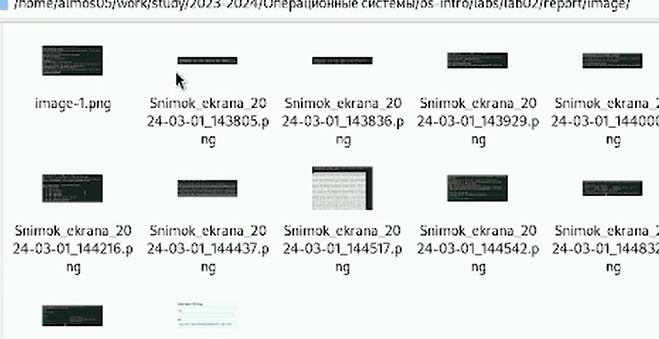
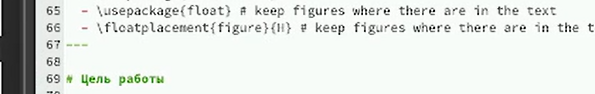
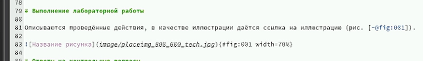
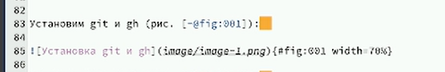
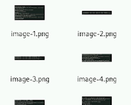
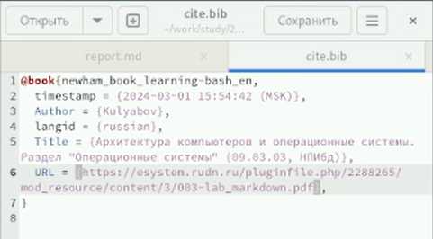

---
## Front matter
title: "Лабораторная работа №3"
subtitle: "Отчёт"
author: "Александр Денисович Мосолов"

## Generic otionsв
lang: ru-RU
toc-title: "Содержание"

## Bibliography
bibliography: bib/cite.bib
csl: pandoc/csl/gost-r-7-0-5-2008-numeric.csl

## Pdf output format
toc: true # Table of contents
toc-depth: 2
lof: true # List of figures
lot: true # List of tables
fontsize: 12pt
linestretch: 1.5
papersize: a4
documentclass: scrreprt
## I18n polyglossia
polyglossia-lang:
  name: russian
  options:
	- spelling=modern
	- babelshorthands=true
polyglossia-otherlangs:
  name: english
## I18n babel
babel-lang: russian
babel-otherlangs: english
## Fonts
mainfont: PT Serif
romanfont: PT Serif
sansfont: PT Sans
monofont: PT Mono
mainfontoptions: Ligatures=TeX
romanfontoptions: Ligatures=TeX
sansfontoptions: Ligatures=TeX,Scale=MatchLowercase
monofontoptions: Scale=MatchLowercase,Scale=0.9
## Biblatex
biblatex: true
biblio-style: "gost-numeric"
biblatexoptions:
  - parentracker=true
  - backend=biber
  - hyperref=auto
  - language=auto
  - autolang=other*
  - citestyle=gost-numeric
## Pandoc-crossref LaTeX customization
figureTitle: "Рис."
tableTitle: "Таблица"
listingTitle: "Листинг"
lofTitle: "Список иллюстраций"
lotTitle: "Список таблиц"
lolTitle: "Листинги"
## Misc options
indent: true
header-includes:
  - \usepackage{indentfirst}
  - \usepackage{float} # keep figures where there are in the text
  - \floatplacement{figure}{H} # keep figures where there are in the text
---

# Цель работы

Научиться оформлять отчёты с помощью легковесного языка разметки Markdown. [@TUIS]

# Задание

Сделайте отчёт по предыдущей лабораторной работе в формате Markdown.
– В качестве отчёта просьба предоставить отчёты в 3 форматах: pdf, docx и md (в архиве,
поскольку он должен содержать скриншоты, Makefile и т.д.)

# Выполнение лабораторной работы

Установим git и gh (рис. [-@fig:001]):

{#fig:001 width=70%}

Зададим имя и email владельца репозитория (рис. [-@fig:002]):  
*git config --global user.name "Aleksandr Mosolov"*  
*git config --global user.email "tenderboylive2@gmail.com"*:

{#fig:002 width=70%}

Настроим utf-8 в выводе сообщений git
Зададим имя начальной ветки (будем называть её master)
Параметр autocrlf
Параметр safecrlf (рис. [-@fig:003]):

{#fig:003 width=70%}

По алгоритму rsa с ключём размером 4096 бит (рис. [-@fig:004]):  
*ssh-keygen -t rsa -b 4096*

{#fig:004 width=70%}

По алгоритму ed25519 (рис. [-@fig:005]):  
*ssh-keygen -t ed25519*

{#fig:005 width=70%}

Генерируем ключ (рис. [-@fig:006]):  
*gpg --full-generate-key*  

Из предложенных опций выбираем:  
тип RSA and RSA;
размер 4096;
выберите срок действия; значение по умолчанию — 0 (срок действия не истекает никогда).

{#fig:006 width=70%}

Выводим список ключей и копируем отпечаток приватного ключа:  
*gpg --list-secret-keys --keyid-format LONG*

Выводим и копируем ключ (рис. [-@fig:009]):  
*gpg --armor --export tenderboylive2@gmail.com | cat*

{#fig:009 width=70%}

Переходим в настройки GitHub (https://github.com/settings/keys), нажмаем на кнопку New GPG key и вставляем полученный ключ в поле ввода.

Настраиваем конфиг (рис. [-@fig:010]):  
*git config --global user.signingkey tenderboylive2@gmail.com*  
*git config --global commit.gpgsign true*  
*git config --global gpg.program $(which gpg2)*  

{#fig:010 width=70%}

Необходимо создать шаблон рабочего пространства (рис. [-@fig:011]):  
*mkdir -p ~/work/study/2023-2024/"Операционные системы"*  
*cd ~/work/study/2023-2024/"Операционные системы"*  
*gh repo create study_2023-2024_os-intro --template=yamadharma/course-directory-student-template --public*  
*git clone --recursive git@github.com:<owner>/study_2023-2024_os-intro.git os-intro*

{#fig:011 width=70%}

Переходим в каталог курса и удаляем лишние файлы (рис. [-@fig:012]):  
*cd ~/work/study/2023-2024/"Операционные системы"/os-intro*  
*rm package.json*

{#fig:012 width=70%}

Создаём необходимые каталоги (рис. [-@fig:013]):  
*echo os-intro > COURSE*  
*make*

{#fig:013 width=70%}

Фиксируем изменения на github (рис. [-@fig:014]):  
*git add .*  
*git commit -am 'feat(main): make course structure'*  
*git push*

{#fig:014 width=70%}

# Выводы

В ходе работы мы научились оформлять отчёты с помощью легковесного языка разметки Markdown.

# Список литературы{.unnumbered}

::: {#refs}
:::
