---
## Front matter
lang: ru-RU
title: Лабораторная работа №4
subtitle: Презентация
author:
  - Мосолов А.Д.
institute:
  - Российский университет дружбы народов, Москва, Россия
date: 09 марта 2024

## i18n babel
babel-lang: russian
babel-otherlangs: english

## Formatting pdf
toc: false
toc-title: Содержание
slide_level: 2
aspectratio: 169
section-titles: true
theme: metropolis
header-includes:
 - \metroset{progressbar=frametitle,sectionpage=progressbar,numbering=fraction}
 - '\makeatletter'
 - '\beamer@ignorenonframefalse'
 - '\makeatother'

## Fonts
mainfont: PT Serif
romanfont: PT Serif
sansfont: PT Sans
monofont: PT Mono
mainfontoptions: Ligatures=TeX
romanfontoptions: Ligatures=TeX
sansfontoptions: Ligatures=TeX,Scale=MatchLowercase
monofontoptions: Scale=MatchLowercase,Scale=0.9
---

## Докладчик

:::::::::::::: {.columns align=center}
::: {.column width="70%"}

  * Мосолов Александр Денисович
  * Студент, НПИбд02-23
  * Российский университет дружбы народов
  * [1132236128@pfur.ru](mailto:1132236128@pfur.ru)

:::
::: {.column width="30%"}

:::
::::::::::::::

## Цель

Получение навыков правильной работы с репозиториями git.

## Задание

Выполнить работу для тестового репозитория.  
Преобразовать рабочий репозиторий в репозиторий с git-flow и conventional commits.

## Enable the copr repository

Установка из коллекции репозиториев Copr

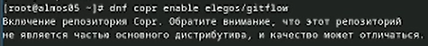

## Install gitflow

Установка gitflow

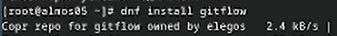

## Установка Node.js

Установка Node.js

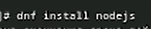

## Установка pnpm

Установка pnpm с помощью wget

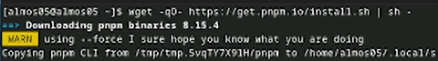

## Запускаем pnpm

Запускаем pnpm и выполняем

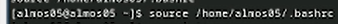

## Клонируем репозиторий

Создаем пустой репозиторий и клонируем его

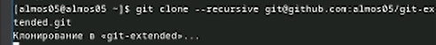

## Standard-changelog

standard-changelog используется для помощи в создании логов

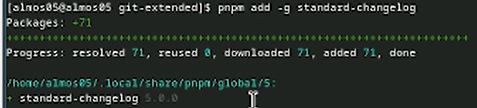

## Commitizen

Commitizen используется для помощи в форматировании коммитов

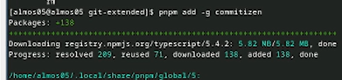

## Первый коммит

Создаем пустой файл README.md, фиксируем изменения и делаем первый коммит

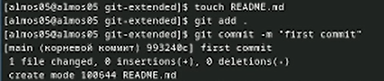

## git push в ветку main

Делаем git push в ветку main

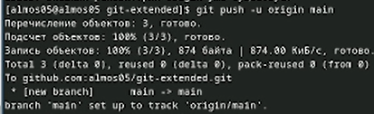

## pnpm init

Конфигурация для пакетов Node.js

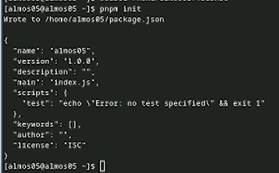

## Изменяем package.json

Изменяем package.json

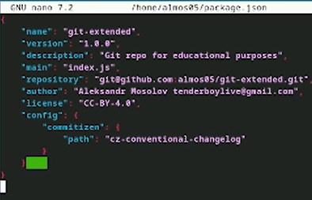

## Заливаем на гитхаб

Добавим новые файлы:  
git add .

Выполним коммит:  
git cz

Отправим на github:  
git push

## Инициализируем git-flow

Инициализируем git-flow, префикс для ярлыков установим в v

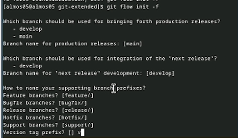

## Ветка develop

Проверьте, что Вы на ветке develop

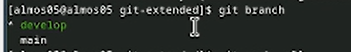

## git push --all

Загружаем весь репозиторий в хранилище

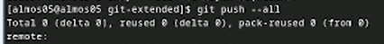

## Внешняя ветка становится вышестоящей

Установим внешнюю ветку как вышестоящую для этой ветки

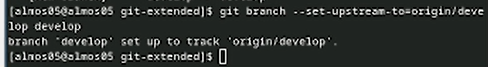

## Создадим релиз с версией 1.0.0

Создадим релиз с версией 1.0.0

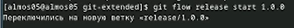

## Добавим журнал изменений в индекс

Создадим журнал изменений  
standard-changelog --first-release  
И добавим журнал изменений в индекс

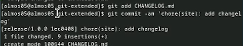

## Отправим данные на github

Зальём релизную ветку в основную ветку  
git flow release finish 1.0.0  
Отправим данные на github

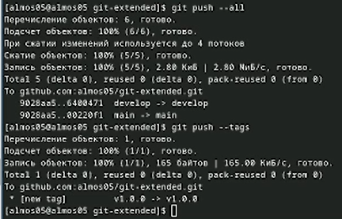{height=50%}

## Создадим релиз на github

Создадим релиз на github. Для этого будем использовать утилиты работы с github

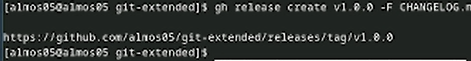

## Создадим ветку для новой функциональности

Создадим ветку для новой функциональности

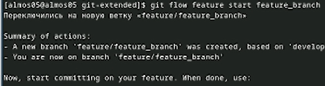

## Создадим релиз с версией 1.2.3

Создадим релиз с версией 1.2.3

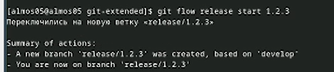

## Обновите номер версии в файле package.

Обновите номер версии в файле package.json. Установите её в 1.2.3

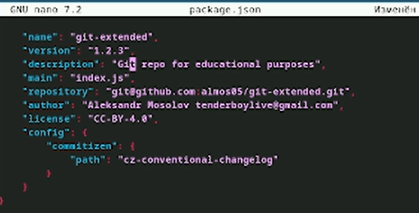

## Создадим журнал изменений

Создадим журнал изменений

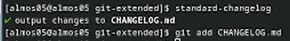

## Добавим журнал изменений в индекс

Добавим журнал изменений в индекс  
git add CHANGELOG.md, сделаем новый коммит

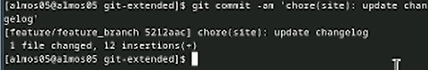

## Зальём релизную ветку в основную ветку

Зальём релизную ветку в основную ветку

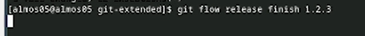

## Отправим данные на github

Отправим данные на github

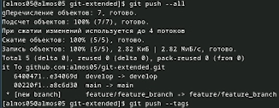

## Создадим релиз на github

Зальём релизную ветку в основную Создадим релиз на github с комментарием из журнала изменений]):

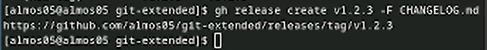

## Выводы

В ходе работы мы получили навыки правильной работы с репозиториями git.
