---
## Front matter
title: "Лабораторная работа №4"
subtitle: "Отчёт"
author: "Александр Денисович Мосолов"

## Generic otionsв
lang: ru-RU
toc-title: "Содержание"

## Bibliography
bibliography: bib/cite.bib
csl: pandoc/csl/gost-r-7-0-5-2008-numeric.csl

## Pdf output format
toc: true # Table of contents
toc-depth: 2
lof: true # List of figures
lot: true # List of tables
fontsize: 12pt
linestretch: 1.5
papersize: a4
documentclass: scrreprt
## I18n polyglossia
polyglossia-lang:
  name: russian
  options:
	- spelling=modern
	- babelshorthands=true
polyglossia-otherlangs:
  name: english
## I18n babel
babel-lang: russian
babel-otherlangs: english
## Fonts
mainfont: PT Serif
romanfont: PT Serif
sansfont: PT Sans
monofont: PT Mono
mainfontoptions: Ligatures=TeX
romanfontoptions: Ligatures=TeX
sansfontoptions: Ligatures=TeX,Scale=MatchLowercase
monofontoptions: Scale=MatchLowercase,Scale=0.9
## Biblatex
biblatex: true
biblio-style: "gost-numeric"
biblatexoptions:
  - parentracker=true
  - backend=biber
  - hyperref=auto
  - language=auto
  - autolang=other*
  - citestyle=gost-numeric
## Pandoc-crossref LaTeX customization
figureTitle: "Рис."
tableTitle: "Таблица"
listingTitle: "Листинг"
lofTitle: "Список иллюстраций"
lotTitle: "Список таблиц"
lolTitle: "Листинги"
## Misc options
indent: true
header-includes:
  - \usepackage{indentfirst}
  - \usepackage{float} # keep figures where there are in the text
  - \floatplacement{figure}{H} # keep figures where there are in the text
---

# Цель работы

Получение навыков правильной работы с репозиториями git.[@TUIS]

# Задание

Выполнить работу для тестового репозитория.  
Преобразовать рабочий репозиторий в репозиторий с git-flow и conventional commits.

# Выполнение лабораторной работы

Установка из коллекции репозиториев Copr (рис. [-@fig:001]):

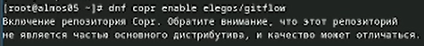{#fig:001 width=70%}

Установка gitflow (рис. [-@fig:002]):

{#fig:002 width=70%}

Установка Node.js (рис. [-@fig:003]):

{#fig:003 width=70%}

Установка pnpm с помощью wget(рис. [-@fig:004]):

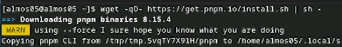{#fig:004 width=70%}

Запускаем pnpm и выполняем (рис. [-@fig:005]):

{#fig:005 width=70%}

Создаем пустой репозиторий и клонируем его (рис. [-@fig:006]):

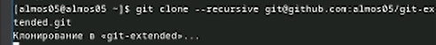{#fig:006 width=70%}

standard-changelog используется для помощи в создании логов (рис. [-@fig:007]):

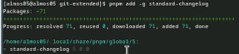{#fig:007 width=70%}

Commitizen используется для помощи в форматировании коммитов (рис. [-@fig:008]):

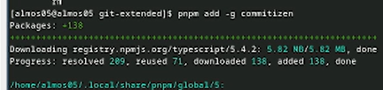{#fig:008 width=70%}

Создаем пустой файл README.md, фиксируем изменения и делаем первый коммит (рис. [-@fig:009]):

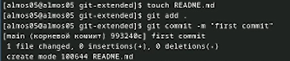{#fig:009 width=70%}

Делаем git push в ветку main (рис. [-@fig:010]):

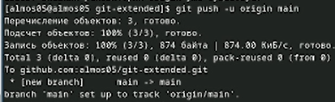{#fig:010 width=70%}

Конфигурация для пакетов Node.js (рис. [-@fig:011]):

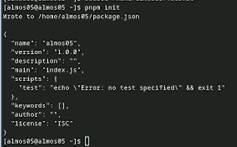{#fig:011 width=70%}

Изменяем package.json (рис. [-@fig:012]):

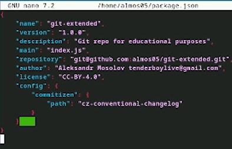{#fig:012 width=70%}

Добавим новые файлы:  
git add .

Выполним коммит:  
git cz

Отправим на github:  
git push

Инициализируем git-flow, префикс для ярлыков установим в v (рис. [-@fig:013]):

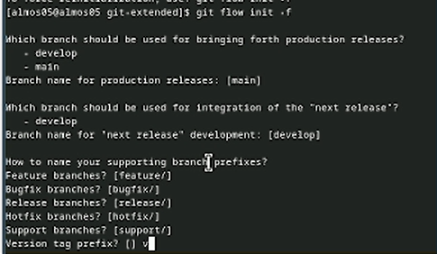{#fig:013 width=70%}

Проверьте, что Вы на ветке develop (рис. [-@fig:014]):

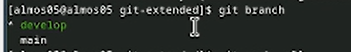{#fig:014 width=70%}

Загружаем весь репозиторий в хранилище (рис. [-@fig:015]):

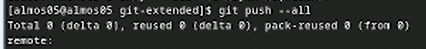{#fig:015 width=70%}

Установим внешнюю ветку как вышестоящую для этой ветки (рис. [-@fig:016]):

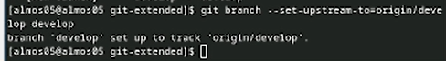{#fig:016 width=70%}

Создадим релиз с версией 1.0.0 (рис. [-@fig:017]):

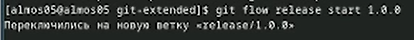{#fig:017 width=70%}

Создадим журнал изменений (рис. [-@fig:018]):  
standard-changelog --first-release  
И добавим журнал изменений в индекс

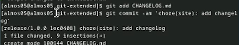{#fig:018 width=70%}

Зальём релизную ветку в основную ветку  
git flow release finish 1.0.0  
Отправим данные на github (рис. [-@fig:019]):

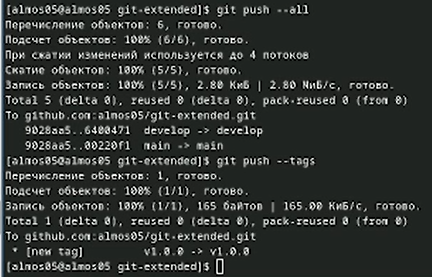{#fig:019 width=70%}

Создадим релиз на github. Для этого будем использовать утилиты работы с github (рис. [-@fig:020]):

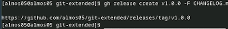{#fig:020 width=70%}

Создадим ветку для новой функциональности (рис. [-@fig:021]):

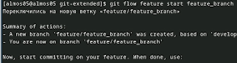{#fig:021 width=70%}

Создадим релиз с версией 1.2.3 (рис. [-@fig:022]):

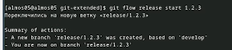{#fig:022 width=70%}

Обновите номер версии в файле package.json. Установите её в 1.2.3 (рис. [-@fig:023]):

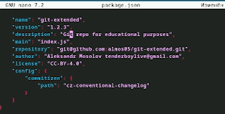{#fig:023 width=70%}

Создадим журнал изменений (рис. [-@fig:024]):

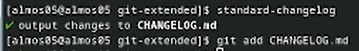{#fig:024 width=70%}

Добавим журнал изменений в индекс  
git add CHANGELOG.md, сделаем новый коммит(рис. [-@fig:025]):

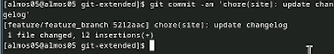{#fig:025 width=70%}

Зальём релизную ветку в основную ветку (рис. [-@fig:026]):

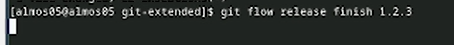{#fig:026 width=70%}

Отправим данные на github (рис. [-@fig:027]):

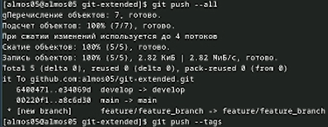{#fig:027 width=70%}

Зальём релизную ветку в основную Создадим релиз на github с комментарием из журнала изменений]):

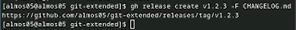{#fig:028 width=70%}

# Выводы

В ходе работы мы получили навыки правильной работы с репозиториями git.

# Список литературы{.unnumbered}

::: {#refs}
:::
