---
## Front matter
lang: ru-RU
title: Лабораторная работа №5
subtitle: "Презентация"
author:
  - Мосолов А.Д.
institute:
  - Российский университет дружбы народов, Москва, Россия
date: 16 марта 2024

## i18n babel
babel-lang: russian
babel-otherlangs: english

## Formatting pdf
toc: false
toc-title: Содержание
slide_level: 2
aspectratio: 169
section-titles: true
theme: metropolis
header-includes:
 - \metroset{progressbar=frametitle,sectionpage=progressbar,numbering=fraction}
 - '\makeatletter'
 - '\beamer@ignorenonframefalse'
 - '\makeatother'

## Fonts
mainfont: PT Serif
romanfont: PT Serif
sansfont: PT Sans
monofont: PT Mono
mainfontoptions: Ligatures=TeX
romanfontoptions: Ligatures=TeX
sansfontoptions: Ligatures=TeX,Scale=MatchLowercase
monofontoptions: Scale=MatchLowercase,Scale=0.9
---

## Докладчик

:::::::::::::: {.columns align=center}
::: {.column width="70%"}

  * Мосолов Александр Денисович
  * Студент, НПИбд02-23
  * Российский университет дружбы народов
  * [1132236128@pfur.ru](mailto:1132236128@pfur.ru)

:::
::: {.column width="30%"}

:::
::::::::::::::

## Цель

Научиться использовать chezmoi для управления файлами конфигурации домашнего каталога пользователя.

## Задание

Установить и настроить менеджер паролей pass, интерфейс с браузером, а также утилиту управления конфигурационными файлами chezmoi.

## Установка pass

Установка pass:

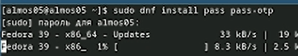

## Установка gopass

Установка gopass:

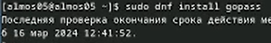

## Просмотр списка ключей

Просмотр списка ключей:

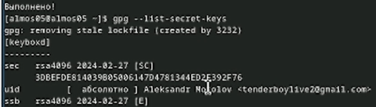

## Инициализируем хранилище

Инициализируем хранилище:

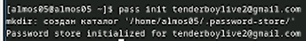

## Проверка

Создадим структуру git:

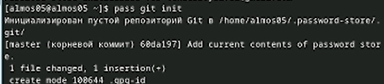

## Задаём адрес репозитория

Также можно задать адрес репозитория на хостинге:

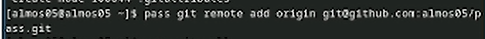

## push в ветку master

Выполняем команду для push'a в ветку master:

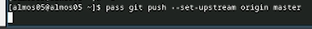

## Синхронизация

Для синхронизации выполняется следующая команда:

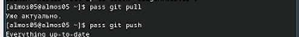

## Закоммичиваем и выкладываем изменения

Если изменения сделаны непосредственно на файловой системе, необходимо вручную закоммитить и выложить изменения:

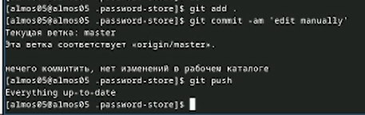

## Статус синхронизации

Проверить статус синхронизации можно командой:

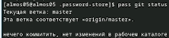

## native messaging

К браузеру устанавливается программа, обеспечивающая интерфейс native messaging:

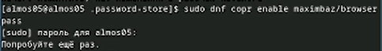

## плагин browserpass

Устанавливается плагин browserpass:

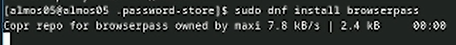

## Плагин для Firefox

Для взаимодействия с браузером используется интерфейс native messaging:

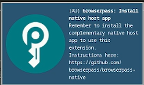

## Добавление нового пароля к файлу

Добавить новый пароль к созданному файлу pass.txt:

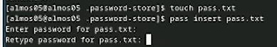

## Отобразить пароль

Отобразите пароль для указанного имени файла:

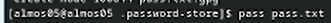

## Заменить существующий пароль

Замените существующий пароль:

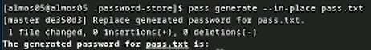

## Установим дополнительное программное обеспечение

Установите дополнительное программное обеспечение:

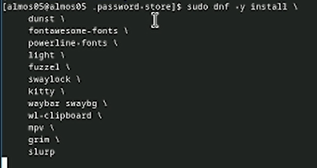

## Установим шрифты (копируем из репозитория)

Установим шрифты:

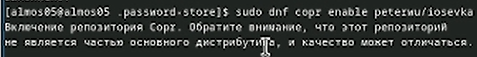

## Установим шрифты (ищем директорию)

Установим шрифты:

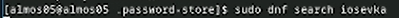

## Установим шрифты (установка шрифтов из директории)

Установим шрифты:

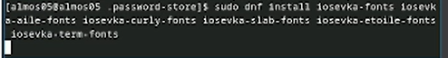

## Скачиваем необходимый файл с помощью wget

Установка бинарного файла. Скрипт определяет архитектуру процессора и операционную систему и скачивает необходимый файл с помощью wget:

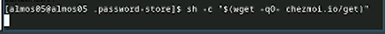

## Создадим свой репозиторий для конфигурационных файлов

Создадим свой репозиторий для конфигурационных файлов на основе шаблона:

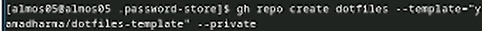

## Инициализируем chezmoi с нашим репозиторием dotfiles

Инициализируйте chezmoi с вашим репозиторием dotfiles:

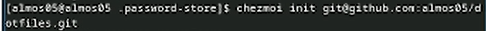

## Изменения в домашнем каталоге

Проверьте, какие изменения внесёт chezmoi в домашний каталог, запустив chezmoi diff:

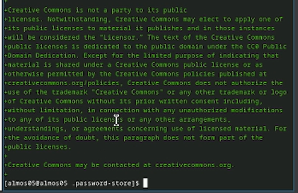{height=50%}

## chezmoi apply -v

Если вас устраивают изменения, внесённые chezmoi, запустите chezmoi apply -v:

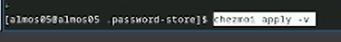

## Установка бинарного файла на вторую виртуальную машину

Установка бинарного файла на вторую виртуальную машину (убунту):

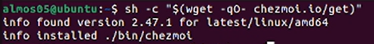

## Инициализируем chezmoi с нашим репозиторием dotfiles

Инициализируйте chezmoi с вашим репозиторием dotfiles:

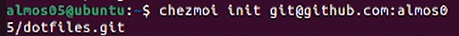

## Создадим релиз на github с комментарием из журнала изменений

Проверьте, какие изменения внесёт chezmoi в домашний каталог, запустив chezmoi diff:

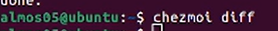

## Изменения на второй машине

Если вас устраивают изменения, внесённые chezmoi, запустите chezmoi apply -v:

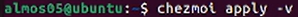

## Установка dotfiles с помощью одной команды

Можно установить свои dotfiles на новый компьютер с помощью одной команды:

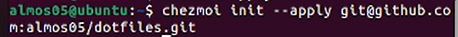

## chezmoi update

Можно извлечь изменения из репозитория и применить их одной командой:

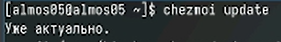

## Извлекаем последние изменения

Извлеките последние изменения из своего репозитория и посмотрите, что изменится, фактически не применяя изменения  
Выполните:  
chezmoi git pull -- --autostash --rebase && chezmoi diff

## chezmoi apply

Если вы довольны изменениями, вы можете применить их:

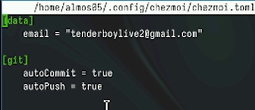

## Выводы

В данной работе были установлены и настроены менеджер паролей pass, интерфейс с браузером и утилита управления конфигурационными файлами chezmoi.
