---
## Front matter
title: "Лабораторная работа №5"
subtitle: "Отчёт"
author: "Александр Денисович Мосолов"

## Generic otionsв
lang: ru-RU
toc-title: "Содержание"

## Bibliography
bibliography: bib/cite.bib
csl: pandoc/csl/gost-r-7-0-5-2008-numeric.csl

## Pdf output format
toc: true # Table of contents
toc-depth: 2
lof: true # List of figures
lot: true # List of tables
fontsize: 12pt
linestretch: 1.5
papersize: a4
documentclass: scrreprt
## I18n polyglossia
polyglossia-lang:
  name: russian
  options:
	- spelling=modern
	- babelshorthands=true
polyglossia-otherlangs:
  name: english
## I18n babel
babel-lang: russian
babel-otherlangs: english
## Fonts
mainfont: PT Serif
romanfont: PT Serif
sansfont: PT Sans
monofont: PT Mono
mainfontoptions: Ligatures=TeX
romanfontoptions: Ligatures=TeX
sansfontoptions: Ligatures=TeX,Scale=MatchLowercase
monofontoptions: Scale=MatchLowercase,Scale=0.9
## Biblatex
biblatex: true
biblio-style: "gost-numeric"
biblatexoptions:
  - parentracker=true
  - backend=biber
  - hyperref=auto
  - language=auto
  - autolang=other*
  - citestyle=gost-numeric
## Pandoc-crossref LaTeX customization
figureTitle: "Рис."
tableTitle: "Таблица"
listingTitle: "Листинг"
lofTitle: "Список иллюстраций"
lotTitle: "Список таблиц"
lolTitle: "Листинги"
## Misc options
indent: true
header-includes:
  - \usepackage{indentfirst}
  - \usepackage{float} # keep figures where there are in the text
  - \floatplacement{figure}{H} # keep figures where there are in the text
---

# Цель работы

Научиться использовать chezmoi для управления файлами конфигурации домашнего каталога пользователя.[@TUIS]

# Задание

Установить и настроить менеджер паролей pass, интерфейс с браузером, а также утилиту управления конфигурационными файлами chezmoi.

# Выполнение лабораторной работы

Установка pass (рис. [-@fig:001]):

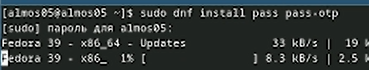{#fig:001 width=70%}

Установка gopass (рис. [-@fig:002]):

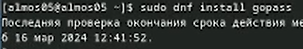{#fig:002 width=70%}

Просмотр списка ключей (рис. [-@fig:003]):

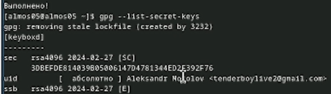{#fig:003 width=70%}

Инициализируем хранилище (рис. [-@fig:004]):

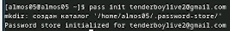{#fig:004 width=70%}

Создадим структуру git (рис. [-@fig:005]):

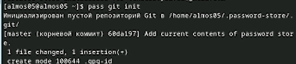{#fig:005 width=70%}

Также можно задать адрес репозитория на хостинге (рис. [-@fig:006]):

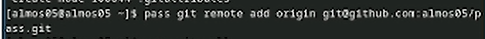{#fig:006 width=70%}

Выполняем команду для push'a в ветку master (рис. [-@fig:007]):

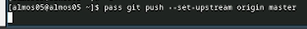{#fig:007 width=70%}

Для синхронизации выполняется следующая команда (рис. [-@fig:008]):

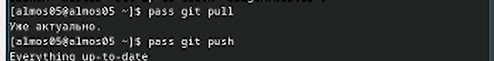{#fig:008 width=70%}

Если изменения сделаны непосредственно на файловой системе, необходимо вручную закоммитить и выложить изменения (рис. [-@fig:009]):

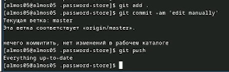{#fig:009 width=70%}

Проверить статус синхронизации можно командой (рис. [-@fig:010]):

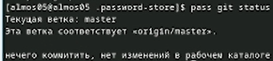{#fig:010 width=70%}

К браузеру устанавливается программа, обеспечивающая интерфейс native messaging (рис. [-@fig:011]):

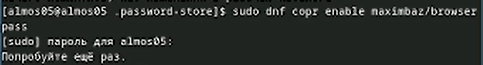{#fig:011 width=70%}

Устанавливается плагин browserpass (рис. [-@fig:012]):

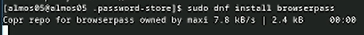{#fig:012 width=70%}

Для взаимодействия с браузером используется интерфейс native messaging (рис. [-@fig:013]):

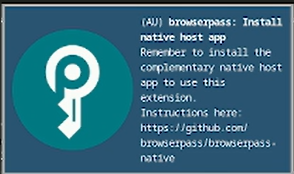{#fig:013 width=70%}

Добавить новый пароль к созданному файлу pass.txt (рис. [-@fig:014]):

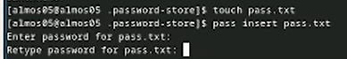{#fig:014 width=70%}

Отобразите пароль для указанного имени файла (рис. [-@fig:015]):

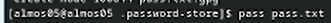{#fig:015 width=70%}

Замените существующий пароль (рис. [-@fig:016]):

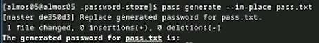{#fig:016 width=70%}

Установите дополнительное программное обеспечение (рис. [-@fig:017]):

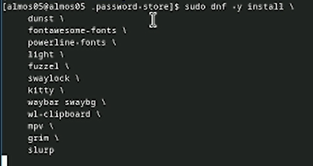{#fig:017 width=70%}

Установим шрифты (рис. [-@fig:018]):

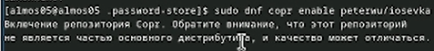{#fig:018 width=70%}

Установим шрифты (рис. [-@fig:019]):

{#fig:019 width=70%}

Установим шрифты (рис. [-@fig:020]):

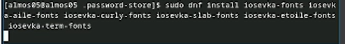{#fig:020 width=70%}

Установка бинарного файла. Скрипт определяет архитектуру процессора и операционную систему и скачивает необходимый файл с помощью wget (рис. [-@fig:021]):

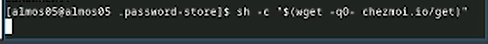{#fig:021 width=70%}

Создадим свой репозиторий для конфигурационных файлов на основе шаблона (рис. [-@fig:022]):

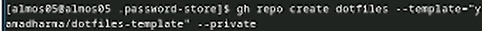{#fig:022 width=70%}

Инициализируйте chezmoi с вашим репозиторием dotfiles (рис. [-@fig:023]):

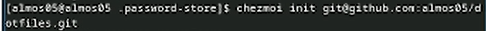{#fig:023 width=70%}

Проверьте, какие изменения внесёт chezmoi в домашний каталог, запустив chezmoi diff (рис. [-@fig:024]):

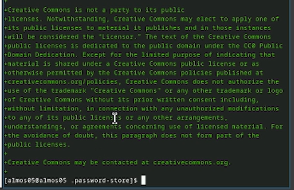{#fig:024 width=70%}

Если вас устраивают изменения, внесённые chezmoi, запустите chezmoi apply -v (рис. [-@fig:025]):

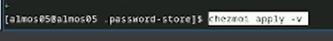{#fig:025 width=70%}

Установка бинарного файла на вторую виртуальную машину (убунту) (рис. [-@fig:026]):

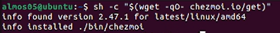{#fig:026 width=70%}

Инициализируйте chezmoi с вашим репозиторием dotfiles (рис. [-@fig:027]):

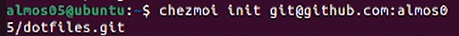{#fig:027 width=70%}

Проверьте, какие изменения внесёт chezmoi в домашний каталог, запустив chezmoi diff (рис. [-@fig:028]):

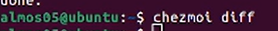{#fig:028 width=70%}

Если вас устраивают изменения, внесённые chezmoi, запустите chezmoi apply -v (рис. [-@fig:029]):

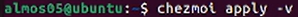{#fig:029 width=70%}

Можно установить свои dotfiles на новый компьютер с помощью одной команды (рис. [-@fig:030]):

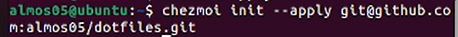{#fig:030 width=70%}

Можно извлечь изменения из репозитория и применить их одной командой (рис. [-@fig:031]):

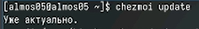{#fig:031 width=70%}

Извлеките последние изменения из своего репозитория и посмотрите, что изменится, фактически не применяя изменения  
Выполните:  
chezmoi git pull -- --autostash --rebase && chezmoi diff

Если вы довольны изменениями, вы можете применить их (рис. [-@fig:033]):

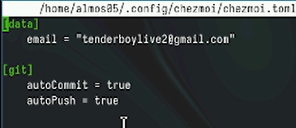{#fig:033 width=70%}

# Выводы

В данной работе были установлены и настроены менеджер паролей pass, интерфейс с браузером и утилита управления конфигурационными файлами chezmoi.

# Список литературы{.unnumbered}

::: {#refs}
:::
