---
## Front matter
lang: ru-RU
title: Лабораторная работа №6
subtitle: "Презентация"
author:
  - Мосолов А.Д.
institute:
  - Российский университет дружбы народов, Москва, Россия
date: 16 марта 2024

## i18n babel
babel-lang: russian
babel-otherlangs: english

## Formatting pdf
toc: false
toc-title: Содержание
slide_level: 2
aspectratio: 169
section-titles: true
theme: metropolis
header-includes:
 - \metroset{progressbar=frametitle,sectionpage=progressbar,numbering=fraction}
 - '\makeatletter'
 - '\beamer@ignorenonframefalse'
 - '\makeatother'

## Fonts
mainfont: PT Serif
romanfont: PT Serif
sansfont: PT Sans
monofont: PT Mono
mainfontoptions: Ligatures=TeX
romanfontoptions: Ligatures=TeX
sansfontoptions: Ligatures=TeX,Scale=MatchLowercase
monofontoptions: Scale=MatchLowercase,Scale=0.9
---

## Докладчик

:::::::::::::: {.columns align=center}
::: {.column width="70%"}

  * Мосолов Александр Денисович
  * Студент, НПИбд02-23
  * Российский университет дружбы народов
  * [1132236128@pfur.ru](mailto:1132236128@pfur.ru)

:::
::: {.column width="30%"}

:::
::::::::::::::

## Цель

Приобретение практических навыков взаимодействия пользователя с системой по-
средством командной строки.

## Использование pwd

Определите полное имя вашего домашнего каталога:

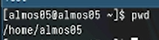

## Переходим в каталог /tmp

Перейдите в каталог /tmp:

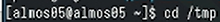

## Использование ls

Выведем на экран содержимое каталога с помощью ls:

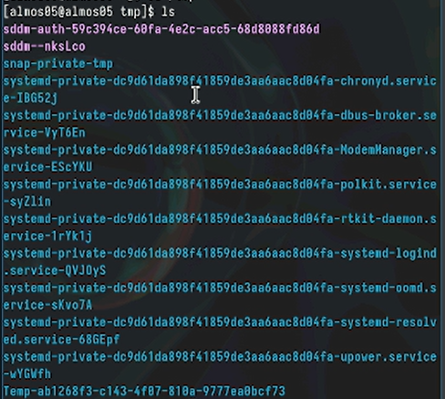{height=50%}

## Использование ls -a

Выведем на экран содержимое каталога с помощью ls -a:

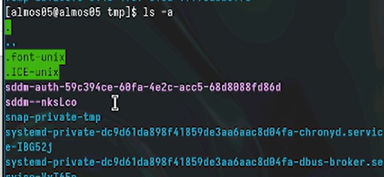

## Использование ls -l

Выведем на экран содержимое каталога с помощью ls -l:

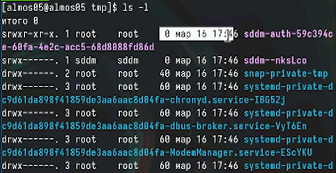

## Использование ls -F

Выведем на экран содержимое каталога с помощью ls -F:

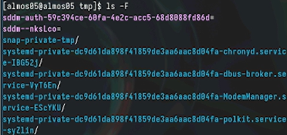

## Каталог /var/spool

Определим, есть ли в каталоге /var/spool подкаталог с именем cron: да, есть:

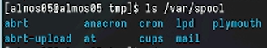

## Узнаем владельца каталогов

Перейдите в Ваш домашний каталог и выведите на экран его содержимое. Владельцем файлов и подкаталогов является almos05.:

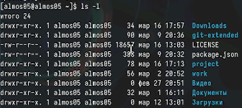

## В домашнем каталоге создайте новый каталог с именем newdir

В домашнем каталоге создайте новый каталог с именем newdir:

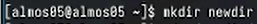

## В каталоге ~/newdir создайте новый каталог с именем morefun

В каталоге ~/newdir создайте новый каталог с именем morefun:

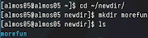

## Три новых каталога с именами letters, memos, misk

В домашнем каталоге создайте одной командой три новых каталога с именами letters, memos, misk:

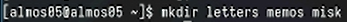

## Удаление каталогов

Затем удалите эти каталоги одной командой:

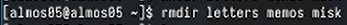

## Проверка работы rm

Попробуйте удалить ранее созданный каталог ~/newdir командой rm. Проверьте, был ли каталог удалён. Он не был удален, тк в папке newdir есть еще одна папка.:

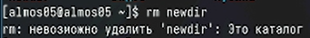

## Удаляем каталог morefun

Удалите каталог ~/newdir/morefun из домашнего каталога. Проверяем с помощью ls, что каталог удален.:

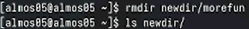

## Выбираем опцию с помощью man

С помощью команды man определите, какую опцию команды ls нужно использовать для просмотра содержимое не только указанного каталога, но и подкаталогов, входящих в него.:

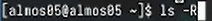

## Набор опций команды ls

С помощью команды man определите набор опций команды ls, позволяющий отсортировать по времени последнего изменения выводимый список содержимого каталога с развёрнутым описанием файлов:

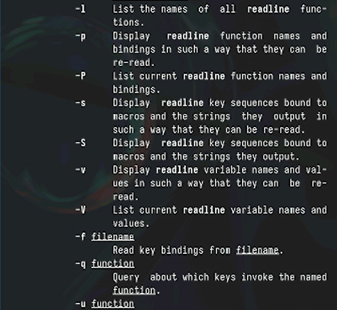{height=50%}

## Набор опций команды pwd)

Просматриваем набор опций команды pwd:

{height=50%}

## Набор опций команды mkdir

Просматриваем набор опций команды mkdir:

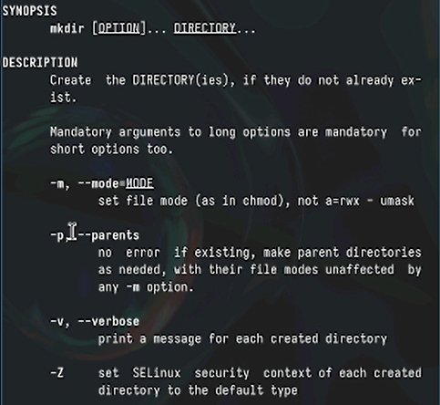{height=50%}

## Набор опций команды rmdir

Просматриваем набор опций команды rmdir:

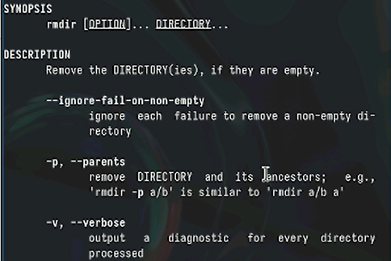{height=50%}

## Набор опций команды rm

Установка бинарного файла. Скрипт определяет архитектуру процессора и операционную систему и скачивает необходимый файл с помощью wget:

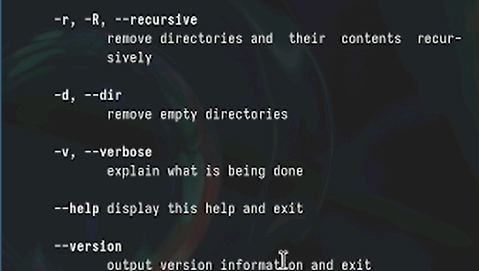{height=50%}

## Создадим свой репозиторий для конфигурационных файлов

Вводим в консоль history и запоминаем опцию -l на 408 месте:

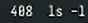

## Поменяем команду c ls -l на ls -a

Поменяем команду c ls -l на ls -a:

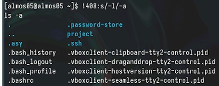

## Выводы

В данной работе мы приобрели практических навыки взаимодействия пользователя с системой по-
средством командной строки.
