---
## Front matter
title: "Лабораторная работа №6"
subtitle: "Отчёт"
author: "Александр Денисович Мосолов"

## Generic otionsв
lang: ru-RU
toc-title: "Содержание"

## Bibliography
bibliography: bib/cite.bib
csl: pandoc/csl/gost-r-7-0-5-2008-numeric.csl

## Pdf output format
toc: true # Table of contents
toc-depth: 2
lof: true # List of figures
lot: true # List of tables
fontsize: 12pt
linestretch: 1.5
papersize: a4
documentclass: scrreprt
## I18n polyglossia
polyglossia-lang:
  name: russian
  options:
	- spelling=modern
	- babelshorthands=true
polyglossia-otherlangs:
  name: english
## I18n babel
babel-lang: russian
babel-otherlangs: english
## Fonts
mainfont: PT Serif
romanfont: PT Serif
sansfont: PT Sans
monofont: PT Mono
mainfontoptions: Ligatures=TeX
romanfontoptions: Ligatures=TeX
sansfontoptions: Ligatures=TeX,Scale=MatchLowercase
monofontoptions: Scale=MatchLowercase,Scale=0.9
## Biblatex
biblatex: true
biblio-style: "gost-numeric"
biblatexoptions:
  - parentracker=true
  - backend=biber
  - hyperref=auto
  - language=auto
  - autolang=other*
  - citestyle=gost-numeric
## Pandoc-crossref LaTeX customization
figureTitle: "Рис."
tableTitle: "Таблица"
listingTitle: "Листинг"
lofTitle: "Список иллюстраций"
lotTitle: "Список таблиц"
lolTitle: "Листинги"
## Misc options
indent: true
header-includes:
  - \usepackage{indentfirst}
  - \usepackage{float} # keep figures where there are in the text
  - \floatplacement{figure}{H} # keep figures where there are in the text
---

# Цель работы

Приобретение практических навыков взаимодействия пользователя с системой по-
средством командной строки.[@TUIS] 

# Задание

1. Определите полное имя вашего домашнего каталога. Далее относительно этого ката-
лога будут выполняться последующие упражнения.
2. Выполните следующие действия:
2.1. Перейдите в каталог /tmp.
2.2. Выведите на экран содержимое каталога /tmp. Для этого используйте команду ls
с различными опциями. Поясните разницу в выводимой на экран информации.
2.3. Определите, есть ли в каталоге /var/spool подкаталог с именем cron?
2.4. Перейдите в Ваш домашний каталог и выведите на экран его содержимое. Опре-
делите, кто является владельцем файлов и подкаталогов?
3. Выполните следующие действия:
3.1. В домашнем каталоге создайте новый каталог с именем newdir.
3.2. В каталоге ~/newdir создайте новый каталог с именем morefun.
3.3. В домашнем каталоге создайте одной командой три новых каталога с именами
letters, memos, misk. Затем удалите эти каталоги одной командой.
3.4. Попробуйте удалить ранее созданный каталог ~/newdir командой rm. Проверьте,
был ли каталог удалён.
3.5. Удалите каталог ~/newdir/morefun из домашнего каталога. Проверьте, был ли
каталог удалён.
4. С помощью команды man определите, какую опцию команды ls нужно использо-
вать для просмотра содержимое не только указанного каталога, но и подкаталогов,
входящих в него.
5. С помощью команды man определите набор опций команды ls, позволяющий отсорти-
ровать по времени последнего изменения выводимый список содержимого каталога
с развёрнутым описанием файлов.
6. Используйте команду man для просмотра описания следующих команд: cd, pwd, mkdir,
rmdir, rm. Поясните основные опции этих команд.
7. Используя информацию, полученную при помощи команды history, выполните мо-
дификацию и исполнение нескольких команд из буфера команд.

# Выполнение лабораторной работы

Определите полное имя вашего домашнего каталога (рис. [-@fig:001]):

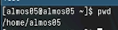{#fig:001 width=70%}

Перейдите в каталог /tmp (рис. [-@fig:002]):

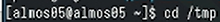{#fig:002 width=70%}

Выведем на экран содержимое каталога с помощью ls (рис. [-@fig:003]):  
Вывод всех файлов и каталогов  
ls

Вывод всех файлов и каталогов, включая скрытые файлы (начинающиеся с точки)  
ls -a

Вывод всех файлов и каталогов, включая подробную информацию о каждом элементе (размер, владелец, дата изменения и т.д.)  
ls -l

Вывод всех файлов и каталогов, отсортированных по размеру  
ls -S

Вывод всех файлов и каталогов, отсортированных по дате изменения  
ls -t

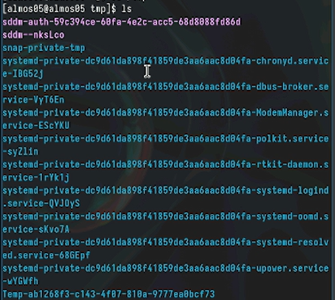{#fig:003 width=70%}

Выведем на экран содержимое каталога с помощью ls -a (рис. [-@fig:004]):

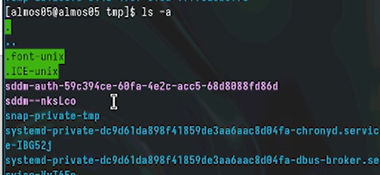{#fig:004 width=70%}

Выведем на экран содержимое каталога с помощью ls -l (рис. [-@fig:005]):

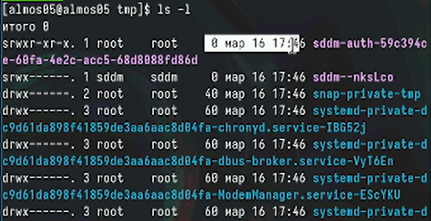{#fig:005 width=70%}

Выведем на экран содержимое каталога с помощью ls -F (рис. [-@fig:006]):

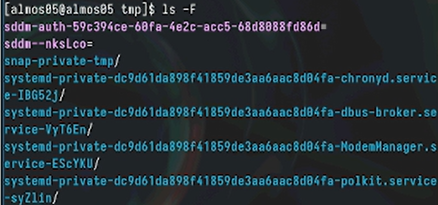{#fig:006 width=70%}

Определим, есть ли в каталоге /var/spool подкаталог с именем cron: да, есть (рис. [-@fig:007]):

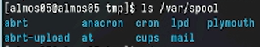{#fig:007 width=70%}

Перейдите в Ваш домашний каталог и выведите на экран его содержимое. Владельцем файлов и подкаталогов является almos05. (рис. [-@fig:008]):

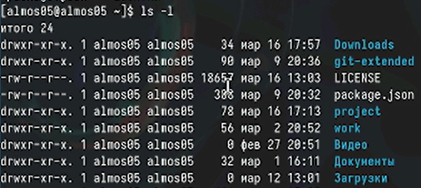{#fig:008 width=70%}

В домашнем каталоге создайте новый каталог с именем newdir (рис. [-@fig:010]):

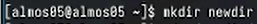{#fig:010 width=70%}

В каталоге ~/newdir создайте новый каталог с именем morefun (рис. [-@fig:011]):

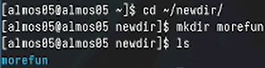{#fig:011 width=70%}

В домашнем каталоге создайте одной командой три новых каталога с именами letters, memos, misk (рис. [-@fig:012]):

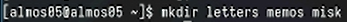{#fig:012 width=70%}

Затем удалите эти каталоги одной командой (рис. [-@fig:013]):

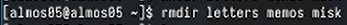{#fig:013 width=70%}

Попробуйте удалить ранее созданный каталог ~/newdir командой rm. Проверьте, был ли каталог удалён. Он не был удален, тк в папке newdir есть еще одна папка. (рис. [-@fig:014]):

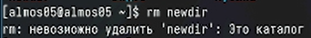{#fig:014 width=70%}

Удалите каталог ~/newdir/morefun из домашнего каталога. Проверяем с помощью ls, что каталог удален. (рис. [-@fig:015]):

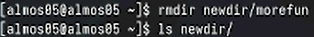{#fig:015 width=70%}

С помощью команды man определите, какую опцию команды ls нужно использовать для просмотра содержимое не только указанного каталога, но и подкаталогов, входящих в него. (рис. [-@fig:016]):

{#fig:016 width=70%}

С помощью команды man определите набор опций команды ls, позволяющий отсортировать по времени последнего изменения выводимый список содержимого каталога с развёрнутым описанием файлов (рис. [-@fig:017]):

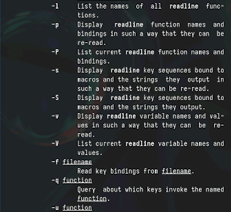{#fig:017 width=70%}

Просматриваем набор опций команды pwd (рис. [-@fig:018]):

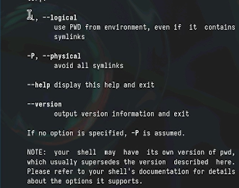{#fig:018 width=70%}

Просматриваем набор опций команды mkdir (рис. [-@fig:019]):

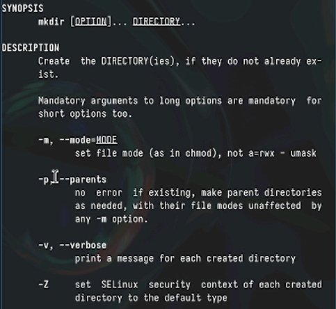{#fig:019 width=70%}

Просматриваем набор опций команды rmdir (рис. [-@fig:020]):

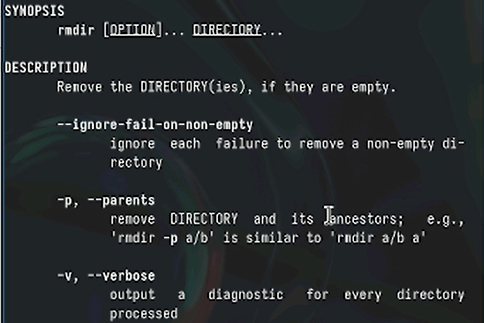{#fig:020 width=70%}

Установка бинарного файла. Скрипт определяет архитектуру процессора и операционную систему и скачивает необходимый файл с помощью wget (рис. [-@fig:021]):

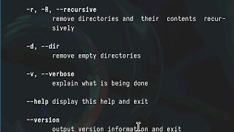{#fig:021 width=70%}

Вводим в консоль history и запоминаем опцию -l на 408 месте (рис. [-@fig:022]):

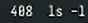{#fig:022 width=70%}

Поменяем команду c ls -l на ls -a (рис. [-@fig:023]):

{#fig:023 width=70%}

# Описание команд

6. Описание команд cd, pwd, mkdir, rmdir, rm:

cd

    Опции:
        -L: перейти по символической ссылке, а не по фактическому каталогу
        -P: перейти по фактическому каталогу, а не по символической ссылке

pwd

    Опции:
        -L: вывести путь к фактическому каталогу, а не по символической ссылке
        -P: вывести путь к символической ссылке, а не по фактическому каталогу

mkdir

    Опции:
        -p: создать все необходимые родительские каталоги
        -m: установить права доступа к новому каталогу

rmdir

    Опции:
        -p: удалить все пустые родительские каталоги
        -v: вывести информацию о каждом удаляемом каталоге

rm

    Опции:
        -i: запрашивать подтверждение перед удалением каждого файла
        -f: удалить файлы без запроса подтверждения
        -r: удалить каталоги и все их содержимое
        -v: вывести информацию о каждом удаляемом файле

# Контрольные вопросы

Командная строка - это интерфейс взаимодействия с операционной системой, который позволяет пользователю вводить команды для выполнения различных операций.

Командой "pwd" можно определить абсолютный путь текущего каталога. Пример: pwd.

Для определения только типов файлов и их имен в текущем каталоге можно использовать команду "ls" с опцией "-F". Пример: ls -F.

Для отображения информации о скрытых файлах используется опция "-a" с командой "ls". Пример: ls -a.

Файл можно удалить командой "rm", а каталог - командой "rmdir". Нельзя удалить и файл, и каталог одной и той же командой. Примеры: rm file.txt, rmdir directory.

Информацию о последних выполненных командах можно вывести с помощью команды "history". Пример: history.

Для модифицированного выполнения команды из истории используется символ "!", за которым следует номер команды в истории. Пример: !5.

Примеры запуска нескольких команд в одной строке:

command1 ; command2
command1 && command2
command1 || command2
Символы экранирования () используются для обозначения специальных символов, чтобы они были восприняты как обычные символы. Примеры: *, $, \.

Вывод информации на экран после выполнения команды "ls" с опцией "-l" содержит подробную информацию о файлах, включая права доступа, владельца, группу, размер, дату изменения и имя файла.

Относительный путь к файлу - это путь, который задается относительно текущего каталога. Например, "documents/file.txt". Противоположностью является абсолютный путь, который начинается с корневого каталога. Примеры использования:

Относительный путь: cd documents
Абсолютный путь: cd /home/user/documents
Информацию о команде можно получить с помощью команды "man" (краткое описание) или "info" (более подробное описание). Пример: man ls.

Для автоматического дополнения вводимых команд используется клавиша Tab.

# Выводы

В данной работе мы приобрели практических навыки взаимодействия пользователя с системой по-
средством командной строки.

# Список литературы{.unnumbered}

::: {#refs}
:::
