---
## Front matter
lang: ru-RU
title: Лабораторная работа №7
subtitle: "Презентация"
author:
  - Мосолов А.Д.
institute:
  - Российский университет дружбы народов, Москва, Россия
date: 23 марта 2024

## i18n babel
babel-lang: russian
babel-otherlangs: english

## Formatting pdf
toc: false
toc-title: Содержание
slide_level: 2
aspectratio: 169
section-titles: true
theme: metropolis
header-includes:
 - \metroset{progressbar=frametitle,sectionpage=progressbar,numbering=fraction}
 - '\makeatletter'
 - '\beamer@ignorenonframefalse'
 - '\makeatother'

## Fonts
mainfont: PT Serif
romanfont: PT Serif
sansfont: PT Sans
monofont: PT Mono
mainfontoptions: Ligatures=TeX
romanfontoptions: Ligatures=TeX
sansfontoptions: Ligatures=TeX,Scale=MatchLowercase
monofontoptions: Scale=MatchLowercase,Scale=0.9
---

## Докладчик

:::::::::::::: {.columns align=center}
::: {.column width="70%"}

  * Мосолов Александр Денисович
  * Студент, НПИбд02-23
  * Российский университет дружбы народов
  * [1132236128@pfur.ru](mailto:1132236128@pfur.ru)

:::
::: {.column width="30%"}

:::
::::::::::::::

## Цель

Ознакомление с файловой системой Linux, её структурой, именами и содержанием каталогов. Приобретение практических навыков по применению команд для работы с файлами и каталогами, по управлению процессами (и работами), по проверке использования диска и обслуживанию файловой системы.

## Задание

Список добавляемых данных.  
Разместить фотографию владельца сайта.  
Разместить краткое описание владельца сайта (Biography).  
Добавить информацию об интересах (Interests).  
Добавить информацию от образовании (Education).  
Добавить первый пост  
Добавить пост о:  
Управление версиями. Git.

# Выполнение

Создание файла abc1

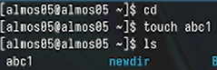

## Скопировать файл ~/abc1 в файл april

Копирование файла в текущем каталоге. Скопировать файл ~/abc1 в файл april

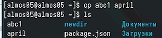

## Скопировать файл ~/abc1 в файл may

Скопировать файл ~/abc1 в файл may

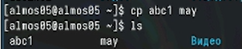

## Скопировать файлы april и may в каталог monthly

Копирование нескольких файлов в каталог. Скопировать файлы april и may в каталог monthly

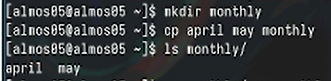

## Скопировать файл monthly/may в файл с именем june

Копирование файлов в произвольном каталоге. Скопировать файл monthly/may в файл с именем june

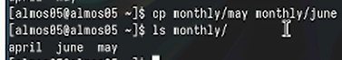

## Скопировать каталог monthly в каталог monthly.00

Копирование каталогов в текущем каталоге. Скопировать каталог monthly в каталог monthly.00

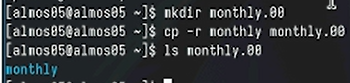

## Скопировать каталог monthly.00 в каталог /tmp

Копирование каталогов в произвольном каталоге. Скопировать каталог monthly.00 в каталог /tmp

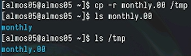

## Изменить название файла april на july в домашнем каталоге

Переименование файлов в текущем каталоге. Изменить название файла april на july в домашнем каталоге

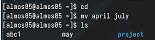

## Переместить файл july в каталог monthly.00

Перемещение файлов в другой каталог. Переместить файл july в каталог monthly.00

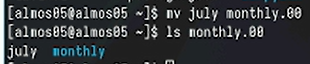

## Переместить каталог monthly.01в каталог reports

Перемещение каталога в другой каталог. Переместить каталог monthly.01в каталог reports

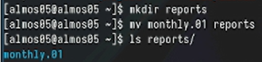

## Переименовать каталог reports/monthly.01 в reports/monthly

Переименование каталога, не являющегося текущим. Переименовать каталог reports/monthly.01 в reports/monthly

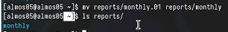

## Требуется создать файл ~/may с правом выполнения для владельца

Требуется создать файл ~/may с правом выполнения для владельца

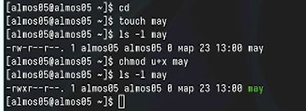

## Требуется лишить владельца файла ~/may права на выполнение

Требуется лишить владельца файла ~/may права на выполнение

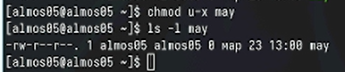

## Cоздать каталог monthly с запретом на чтение

Требуется создать каталог monthly с запретом на чтение для членов группы и всех остальных пользователей

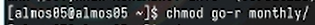

## Требуется создать файл ~/abc1 с правом записи для членов группы

Требуется создать файл ~/abc1 с правом записи для членов группы

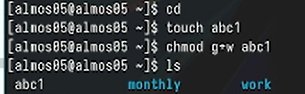

## Скопируйте файл /usr/include/sys/io.h в домашний каталог

Скопируйте файл /usr/include/sys/io.h в домашний каталог и назовите его equipment. Если файла io.h нет, то используйте любой другой файл в каталоге
/usr/include/sys/ вместо него.

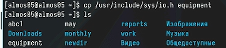

## В домашнем каталоге создайте директорию ~/ski.plases

В домашнем каталоге создайте директорию ~/ski.plases

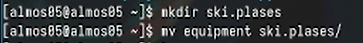

## Переименуйте файл ~/ski.plases/equipment в ~/ski.plases/equiplist

Переименуйте файл ~/ski.plases/equipment в ~/ski.plases/equiplist

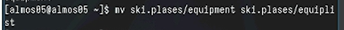 

## equiplist2

Создайте в домашнем каталоге файл abc1 и скопируйте его в каталог ~/ski.plases, назовите его equiplist2

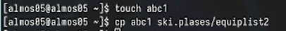

## Создайте каталог с именем equipment в каталоге ~/ski.plases

Создайте каталог с именем equipment в каталоге ~/ski.plases

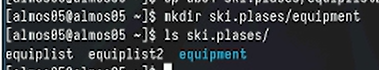

## Переместите файлы equiplist и equiplist2 в каталог equipment

Переместите файлы ~/ski.plases/equiplist и equiplist2 в каталог ~/ski.plases/equipment

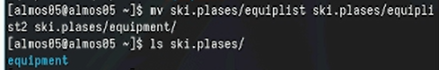

## plans

Создайте и переместите каталог ~/newdir в каталог ~/ski.plases и назовите его plans

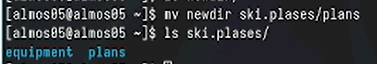

## Команды для задания прав доступа

Определите опции команды chmod, необходимые для того, чтобы присвоить перечисленным ниже файлам выделенные права доступа, считая, что в начале таких прав нет

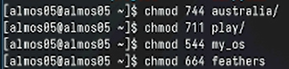

## Проверка прав доступа

Получившиеся права доступа

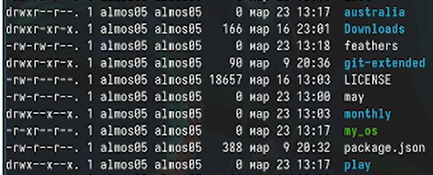

## Просмотрите содержимое файла /etc/password

Просмотрите содержимое файла /etc/passwd

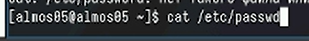

## Скопируйте файл ~/feathers в файл ~/file.old

Скопируйте файл ~/feathers в файл ~/file.old

## Скопируйте файл ~/feathers в файл ~/file.old

Скопируйте файл ~/feathers в файл ~/file.old

## Скопируйте каталог ~/play в каталог ~/fun

Скопируйте каталог ~/play в каталог ~/fun

## Скопируйте каталог ~/play в каталог ~/fun

Скопируйте каталог ~/play в каталог ~/fun

## Лишите владельца файла ~/feathers права на чтение

Лишите владельца файла ~/feathers права на чтение

## Файл ~/feathers

Что произойдёт, если вы попытаетесь скопировать файл ~/feathers?

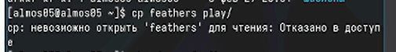

## Дайте владельцу файла ~/feathers право на чтение

Дайте владельцу файла ~/feathers право на чтение

## Лишите владельца каталога ~/play права на выполнение

Лишите владельца каталога ~/play права на выполнение. Перейдите в каталог ~/play. Что произошло?

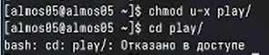

## Дайте владельцу каталога ~/play право на выполнение

Дайте владельцу каталога ~/play право на выполнение

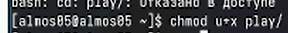

## man по командам mount, fsck, mkfs, kill

Прочитайте man по командам mount, fsck, mkfs, kill и кратко их охарактеризуйте, приведя примеры.

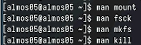

## Выводы

В данной работе мы ознакомились с файловой системой Linux, её структурой, именами и содержанием каталогов. Приобрели практические навыки по применению команд для работы с файлами и каталогами, по управлению процессами (и работами), по проверке использования диска и обслуживанию файловой системы.
