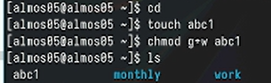

---
## Front matter
title: "Лабораторная работа №7" 
subtitle: "Отчёт"
author: "Александр Денисович Мосолов"

## Generic otionsв
lang: ru-RU
toc-title: "Содержание"

## Bibliography
bibliography: bib/cite.bib
csl: pandoc/csl/gost-r-7-0-5-2008-numeric.csl

## Pdf output format
toc: true # Table of contents
toc-depth: 2
lof: true # List of figures
lot: true # List of tables
fontsize: 12pt
linestretch: 1.5
papersize: a4
documentclass: scrreprt
## I18n polyglossia
polyglossia-lang:
  name: russian
  options:
	- spelling=modern
	- babelshorthands=true
polyglossia-otherlangs:
  name: english
## I18n babel
babel-lang: russian
babel-otherlangs: english
## Fonts
mainfont: PT Serif
romanfont: PT Serif
sansfont: PT Sans
monofont: PT Mono
mainfontoptions: Ligatures=TeX
romanfontoptions: Ligatures=TeX
sansfontoptions: Ligatures=TeX,Scale=MatchLowercase
monofontoptions: Scale=MatchLowercase,Scale=0.9
## Biblatex
biblatex: true
biblio-style: "gost-numeric"
biblatexoptions:
  - parentracker=true
  - backend=biber
  - hyperref=auto
  - language=auto
  - autolang=other*
  - citestyle=gost-numeric
## Pandoc-crossref LaTeX customization
figureTitle: "Рис."
tableTitle: "Таблица"
listingTitle: "Листинг"
lofTitle: "Список иллюстраций"
lotTitle: "Список таблиц"
lolTitle: "Листинги"
## Misc options
indent: true
header-includes:
  - \usepackage{indentfirst}
  - \usepackage{float} # keep figures where there are in the text
  - \floatplacement{figure}{H} # keep figures where there are in the text
---

# Цель работы

Ознакомление с файловой системой Linux, её структурой, именами и содержанием каталогов. Приобретение практических навыков по применению команд для работы с файлами и каталогами, по управлению процессами (и работами), по проверке использования диска и обслуживанию файловой системы.[@TUIS]

# Задание

Список добавляемых данных.  
Разместить фотографию владельца сайта.  
Разместить краткое описание владельца сайта (Biography).  
Добавить информацию об интересах (Interests).  
Добавить информацию от образовании (Education).  
Добавить первый пост  
Добавить пост о:  
Управление версиями. Git.

# Выполнение

Создание файла abc1 (рис. [-@fig:001])

{#fig:001 width=70%}

Копирование файла в текущем каталоге. Скопировать файл ~/abc1 в файл april (рис. [-@fig:002])

{#fig:002 width=70%}

Скопировать файл ~/abc1 в файл may (рис. [-@fig:003])

{#fig:003 width=70%}

Копирование нескольких файлов в каталог. Скопировать файлы april и may в каталог monthly (рис. [-@fig:004])

{#fig:004 width=70%}

Копирование файлов в произвольном каталоге. Скопировать файл monthly/may в файл с именем june (рис. [-@fig:005])

{#fig:005 width=70%}

Копирование каталогов в текущем каталоге. Скопировать каталог monthly в каталог monthly.00 (рис. [-@fig:006])

{#fig:006 width=70%}

Копирование каталогов в произвольном каталоге. Скопировать каталог monthly.00 в каталог /tmp (рис. [-@fig:007])

{#fig:007 width=70%}

Переименование файлов в текущем каталоге. Изменить название файла april на july в домашнем каталоге (рис. [-@fig:008])

{#fig:008 width=70%}

Перемещение файлов в другой каталог. Переместить файл july в каталог monthly.00 (рис. [-@fig:009])

{#fig:009 width=70%}

Перемещение каталога в другой каталог. Переместить каталог monthly.01в каталог reports (рис. [-@fig:010])

{#fig:010 width=70%}

Переименование каталога, не являющегося текущим. Переименовать каталог reports/monthly.01 в reports/monthly (рис. [-@fig:011])

{#fig:011 width=70%}

Требуется создать файл ~/may с правом выполнения для владельца (рис. [-@fig:012])

{#fig:012 width=70%}

Требуется лишить владельца файла ~/may права на выполнение (рис. [-@fig:013])

{#fig:013 width=70%}

Требуется создать каталог monthly с запретом на чтение для членов группы и всех остальных пользователей (рис. [-@fig:014])

{#fig:014 width=70%}

Требуется создать файл ~/abc1 с правом записи для членов группы (рис. [-@fig:015])

{#fig:015 width=70%}

Скопируйте файл /usr/include/sys/io.h в домашний каталог и назовите его equipment. Если файла io.h нет, то используйте любой другой файл в каталоге
/usr/include/sys/ вместо него. (рис. [-@fig:016])

{#fig:016 width=70%}

В домашнем каталоге создайте директорию ~/ski.plases (рис. [-@fig:017])

{#fig:017 width=70%}

Переименуйте файл ~/ski.plases/equipment в ~/ski.plases/equiplist (рис. [-@fig:018])

{#fig:018 width=70%} 

Создайте в домашнем каталоге файл abc1 и скопируйте его в каталог ~/ski.plases, назовите его equiplist2 (рис. [-@fig:019])

{#fig:019 width=70%}

Создайте каталог с именем equipment в каталоге ~/ski.plases (рис. [-@fig:020])

{#fig:020 width=70%}

Переместите файлы ~/ski.plases/equiplist и equiplist2 в каталог ~/ski.plases/equipment (рис. [-@fig:021])

{#fig:021 width=70%}

Создайте и переместите каталог ~/newdir в каталог ~/ski.plases и назовите его plans (рис. [-@fig:022])

{#fig:022 width=70%}

Определите опции команды chmod, необходимые для того, чтобы присвоить перечисленным ниже файлам выделенные права доступа, считая, что в начале таких прав нет (рис. [-@fig:023])

{#fig:023 width=70%}

Получившиеся права доступа (рис. [-@fig:024])

{#fig:024 width=70%}

Просмотрите содержимое файла /etc/passwd (рис. [-@fig:025])

{#fig:025 width=70%}

Скопируйте файл ~/feathers в файл ~/file.old (рис. [-@fig:026])

{#fig:026 width=70%}

Скопируйте файл ~/feathers в файл ~/file.old (рис. [-@fig:027])

{#fig:027 width=70%}

Скопируйте каталог ~/play в каталог ~/fun (рис. [-@fig:028])

{#fig:028 width=70%}

Скопируйте каталог ~/play в каталог ~/fun (рис. [-@fig:029])

{#fig:029 width=70%}

Лишите владельца файла ~/feathers права на чтение (рис. [-@fig:030])

{#fig:030 width=70%}

Что произойдёт, если вы попытаетесь скопировать файл ~/feathers? (рис. [-@fig:031])

{#fig:031 width=70%}

Дайте владельцу файла ~/feathers право на чтение (рис. [-@fig:032])

{#fig:032 width=70%}

Лишите владельца каталога ~/play права на выполнение. Перейдите в каталог ~/play. Что произошло? (рис. [-@fig:033])

{#fig:033 width=70%}

Дайте владельцу каталога ~/play право на выполнение (рис. [-@fig:034])

{#fig:034 width=70%}

Прочитайте man по командам mount, fsck, mkfs, kill и кратко их охарактеризуйте, приведя примеры. (рис. [-@fig:035])

{#fig:035 width=70%}

# Контрольные вопросы

1. **Характеристика файловых систем:**
   - **ext4**: Распространенная файловая система в Linux. Поддерживает журналирование и хорошо подходит для больших дисков.
   - **Btrfs**: Позволяет использовать снимки, проверку целостности данных и другие продвинутые функции.
   - **XFS**: Хорошо подходит для крупных файлов и больших томов, обеспечивает высокую производительность.
   - **tmpfs**: Виртуальная файловая система, хранящаяся в оперативной памяти.

2. **Общая структура файловой системы:**
   - **/** (корневая директория): Содержит все остальные файлы и директории.
   - **/bin**: Бинарные исполняемые файлы.
   - **/etc**: Конфигурационные файлы.
   - **/home**: Домашние директории пользователей.
   - **/var**: Переменные данные, например, логи.
   - **/tmp**: Временные файлы.

3. Для доступа к содержимому файловой системы операционная система должна произвести монтирование этой файловой системы.

4. **Причины нарушения целостности файловой системы:**
   - Некорректное завершение работы.
   - Аппаратные сбои.
   - Вредоносные программы.
   - Недостаток места на диске.
   - Физические повреждения диска.
   Для восстановления целостности можно использовать инструменты проверки и восстановления файловой системы, такие как fsck в Linux.

5. **Создание файловой системы:** Файловая система создается при форматировании раздела с использованием утилиты mkfs.

6. **Команды для просмотра текстовых файлов:**
   - **cat**: Показывает содержимое файла.
   - **less**: Позволяет просматривать файл постранично.
   - **more**: Подобно less, но имеет ограниченные возможности прокрутки.

7. **Основные возможности команды cp в Linux:**
   - Копирование файлов и директорий.
   - Сохранение атрибутов файлов.
   - Рекурсивное копирование директорий.

8. **Основные возможности команды mv в Linux:**
   - Перемещение файлов и директорий.
   - Переименование файлов и директорий.

9. **Права доступа:** Определяют, кто и как может читать, записывать и исполнять файлы или директории. Изменить их можно с помощью команды chmod в Linux.

Помните, что конкретные детали могут различаться в зависимости от версии Linux и используемых утилит. Для более точной информации рекомендуется обратиться к документации вашей операционной системы или к специализированным ресурсам по Linux.

# Выводы

В данной работе мы ознакомились с файловой системой Linux, её структурой, именами и содержанием каталогов. Приобрели практические навыки по применению команд для работы с файлами и каталогами, по управлению процессами (и работами), по проверке использования диска и обслуживанию файловой системы.

# Список литературы{.unnumbered}

::: {#refs}
:::
