---
## Front matter
lang: ru-RU
title: Лабораторная работа №8
subtitle: "Презентация"
author:
  - Мосолов А.Д.
institute:
  - Российский университет дружбы народов, Москва, Россия
date: 23 марта 2024

## i18n babel
babel-lang: russian
babel-otherlangs: english

## Formatting pdf
toc: false
toc-title: Содержание
slide_level: 2
aspectratio: 169
section-titles: true
theme: metropolis
header-includes:
 - \metroset{progressbar=frametitle,sectionpage=progressbar,numbering=fraction}
 - '\makeatletter'
 - '\beamer@ignorenonframefalse'
 - '\makeatother'

## Fonts
mainfont: PT Serif
romanfont: PT Serif
sansfont: PT Sans
monofont: PT Mono
mainfontoptions: Ligatures=TeX
romanfontoptions: Ligatures=TeX
sansfontoptions: Ligatures=TeX,Scale=MatchLowercase
monofontoptions: Scale=MatchLowercase,Scale=0.9
---

## Докладчик

:::::::::::::: {.columns align=center}
::: {.column width="70%"}

  * Мосолов Александр Денисович
  * Студент, НПИбд02-23
  * Российский университет дружбы народов
  * [1132236128@pfur.ru](mailto:1132236128@pfur.ru)

:::
::: {.column width="30%"}

:::
::::::::::::::

## Цель

Ознакомление с инструментами поиска файлов и фильтрации текстовых данных. Приобретение практических навыков: по управлению процессами (и заданиями), по проверке использования диска и обслуживанию файловых систем.

## Выведите имена всех файлов из file.txt, имеющих расширение .conf

Выведите имена всех файлов из file.txt, имеющих расширение .conf, после чего запишите их в новый текстовой файл conf.txt.

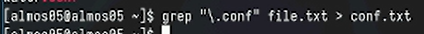

## Определите, какие файлы в вашем домашнем каталоге имеют имена, начинавшиеся с символа c

Определите, какие файлы в вашем домашнем каталоге имеют имена, начинавшиеся с символа c?

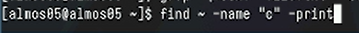

## Вариант нахождения файлов с помощью ls

Определите, какие файлы в вашем домашнем каталоге имеют имена, начинавшиеся с символа c?

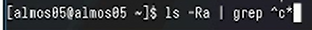

## Выведите на экран (по странично) имена файлов из каталога /etc, начинающиеся с символа h

Выведите на экран (по странично) имена файлов из каталога /etc, начинающиеся с символа h

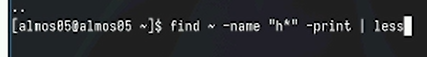

## Запустите в фоновом режиме процесс, который будет записывать в файл ~/logfile файлы

Запустите в фоновом режиме процесс, который будет записывать в файл ~/logfile файлы, имена которых начинаются с log

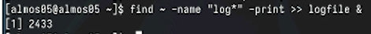

## Удалите файл ~/logfile

Удалите файл ~/logfile

## Запустите из консоли в фоновом режиме редактор gedit

Запустите из консоли в фоновом режиме редактор gedit

## Определите идентификатор процесса gedit, используя jobs

Определите идентификатор процесса gedit, используя jobs.

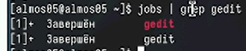

## Определите идентификатор процесса gedit, используя команду ps

Определите идентификатор процесса gedit, используя команду ps

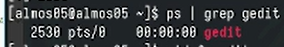

## Определите идентификатор процесса gedit, используя команду pidof

Определите идентификатор процесса gedit, используя команду pidof

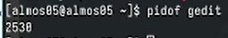

## используйте kill для завершения процесса gedit

Прочтите справку (man) команды kill, после чего используйте её для завершения процесса gedit

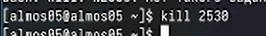

## Выполните команды df

Выполните команды df и du, предварительно получив более подробную информацию об этих командах

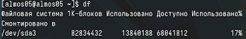

## Выполните команды du

Выполните команды df и du, предварительно получив более подробную информацию об этих командах

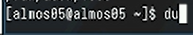

## Выведите имена всех директорий

Воспользовавшись справкой команды find, выведите имена всех директорий, имеющихся в вашем домашнем каталоге

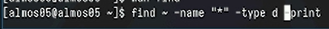

## Выводы

В данной работе мы ознакомились с инструментами поиска файлов и фильтрации текстовых данных. Приобрели практические навыки: по управлению процессами (и заданиями), по проверке использования диска и обслуживанию файловых систем.
