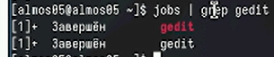

---
## Front matter
title: "Лабораторная работа №8" 
subtitle: "Отчёт"
author: "Александр Денисович Мосолов"

## Generic otionsв
lang: ru-RU
toc-title: "Содержание"

## Bibliography
bibliography: bib/cite.bib
csl: pandoc/csl/gost-r-7-0-5-2008-numeric.csl

## Pdf output format
toc: true # Table of contents
toc-depth: 2
lof: true # List of figures
lot: true # List of tables
fontsize: 12pt
linestretch: 1.5
papersize: a4
documentclass: scrreprt
## I18n polyglossia
polyglossia-lang:
  name: russian
  options:
	- spelling=modern
	- babelshorthands=true
polyglossia-otherlangs:
  name: english
## I18n babel
babel-lang: russian
babel-otherlangs: english
## Fonts
mainfont: PT Serif
romanfont: PT Serif
sansfont: PT Sans
monofont: PT Mono
mainfontoptions: Ligatures=TeX
romanfontoptions: Ligatures=TeX
sansfontoptions: Ligatures=TeX,Scale=MatchLowercase
monofontoptions: Scale=MatchLowercase,Scale=0.9
## Biblatex
biblatex: true
biblio-style: "gost-numeric"
biblatexoptions:
  - parentracker=true
  - backend=biber
  - hyperref=auto
  - language=auto
  - autolang=other*
  - citestyle=gost-numeric
## Pandoc-crossref LaTeX customization
figureTitle: "Рис."
tableTitle: "Таблица"
listingTitle: "Листинг"
lofTitle: "Список иллюстраций"
lotTitle: "Список таблиц"
lolTitle: "Листинги"
## Misc options
indent: true
header-includes:
  - \usepackage{indentfirst}
  - \usepackage{float} # keep figures where there are in the text
  - \floatplacement{figure}{H} # keep figures where there are in the text
---

# Цель работы

Ознакомление с инструментами поиска файлов и фильтрации текстовых данных. Приобретение практических навыков: по управлению процессами (и заданиями), по проверке использования диска и обслуживанию файловых систем.[@TUIS]

# Задание

# Выполнение

Выведите имена всех файлов из file.txt, имеющих расширение .conf, после чего запишите их в новый текстовой файл conf.txt. (рис. [-@fig:001])

{#fig:001 width=70%}

Определите, какие файлы в вашем домашнем каталоге имеют имена, начинавшиеся с символа c? (рис. [-@fig:002])

{#fig:002 width=70%}

Определите, какие файлы в вашем домашнем каталоге имеют имена, начинавшиеся с символа c? (рис. [-@fig:003])

{#fig:003 width=70%}

Выведите на экран (по странично) имена файлов из каталога /etc, начинающиеся с символа h (рис. [-@fig:004])

{#fig:004 width=70%}

Запустите в фоновом режиме процесс, который будет записывать в файл ~/logfile файлы, имена которых начинаются с log (рис. [-@fig:005])

{#fig:005 width=70%}

Удалите файл ~/logfile (рис. [-@fig:006])

{#fig:006 width=70%}

Запустите из консоли в фоновом режиме редактор gedit (рис. [-@fig:007])

{#fig:007 width=70%}

Определите идентификатор процесса gedit, используя jobs. (рис. [-@fig:008])

{#fig:008 width=70%}

Определите идентификатор процесса gedit, используя команду ps (рис. [-@fig:009])

{#fig:009 width=70%}

Определите идентификатор процесса gedit, используя команду pidof (рис. [-@fig:010])

{#fig:010 width=70%}

Прочтите справку (man) команды kill, после чего используйте её для завершения процесса gedit (рис. [-@fig:011])

{#fig:011 width=70%}

Выполните команды df и du, предварительно получив более подробную информацию об этих командах (рис. [-@fig:012])

{#fig:012 width=70%}

Выполните команды df и du, предварительно получив более подробную информацию об этих командах (рис. [-@fig:013])

{#fig:013 width=70%}

Воспользовавшись справкой команды find, выведите имена всех директорий, имеющихся в вашем домашнем каталоге (рис. [-@fig:014])

{#fig:014 width=70%}

# Контрольные вопросы

1. Потоки ввода/вывода

    Стандартный ввод (stdin): Получает данные, вводимые пользователем или из другого потока ввода. Обычно связан с клавиатурой.
    Стандартный вывод (stdout): Выводит данные на экран или в другой поток вывода. Обычно связан с терминалом.
    Стандартная ошибка (stderr): Выводит сообщения об ошибках. Обычно связан с терминалом, но может быть перенаправлен.

2. Операции > и >>

    > (перенаправление вывода): Перенаправляет вывод команды в файл. Заменяет содержимое файла.
    >> (дополнение вывода): Перенаправляет вывод команды в файл. Дополняет содержимое файла.

3. Конвейер

Конвейер соединяет несколько команд таким образом, что вывод первой команды становится вводом для второй команды и так далее. В Linux оболочке конвейеры создаются с помощью символа вертикальной черты (|).

4. Процесс и программа

    Программа: Набор инструкций, которые должны быть выполнены.
    Процесс: Выполняющийся экземпляр программы. Каждый процесс имеет свой PID (идентификатор процесса).

5. PID и GID

    PID (идентификатор процесса): Уникальный номер, присваиваемый каждому работающему процессу.
    GID (идентификатор группы): Уникальный номер, присваиваемый группе пользователей.

6. Задачи и команда управления

    Задача: Объект, представляющий состояние и работу процесса.
    Команда управления задачами: ps

7. утилиты top и htop

    top: Интерактивная утилита мониторинга системы, показывающая информацию о процессах, использовании памяти и процессора.
    htop: Расширенная альтернатива top с более удобным пользовательским интерфейсом и дополнительными функциями.

8. Команда поиска файлов

    find: Позволяет рекурсивно искать файлы в указанной файловой системе на основе заданных критериев.
    Примеры:
        find . -name "file.txt": Найти файл с именем "file.txt" в текущем каталоге и всех его подкаталогах.
        find . -type f -size +100M: Найти все обычные файлы размером более 100 МБ в текущем каталоге и его подкаталогах.

9. Поиск файлов по контексту

Да, можно искать файлы по контексту с помощью команды grep.

    Синтаксис: grep "шаблон" имя_файла
    Пример: grep "слово" file.txt

10. Определение объема свободной памяти на жестком диске

    df -h: Выводит информацию о доступном дисковом пространстве во всех смонтированных файловых системах.

11. Определение объема домашнего каталога

    du -sh ~: Выводит размер домашнего каталога и всех его подкаталогов.

12. Удаление зависшего процесса

    kill -9 PID: Принудительно завершает процесс с указанным PID. Не используйте это для критических системных процессов.

# Выводы

В данной работе мы ознакомились с инструментами поиска файлов и фильтрации текстовых данных. Приобрели практические навыки: по управлению процессами (и заданиями), по проверке использования диска и обслуживанию файловых систем.

# Список литературы{.unnumbered}

::: {#refs}
:::
